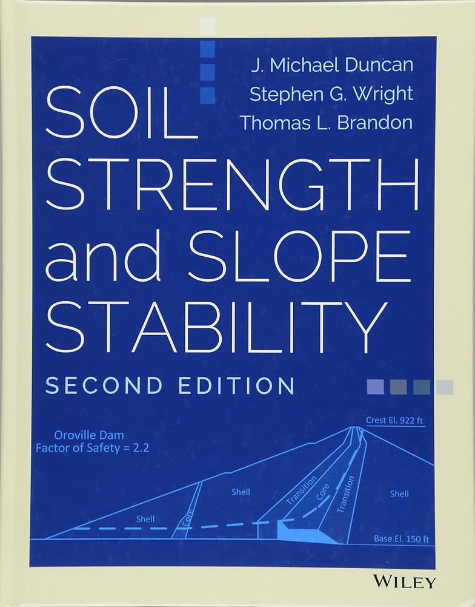

# Textbook

For the slope stability section of this class, we will use the textbook _Soil Strength and Slope Stability, 2nd Edition_ by Duncan, Wright, and Brandon. You can access this textbook for free through the BYU library.

{:width="25%"}

[Soil Strength and Slope Stability, 2nd Edition](https://ebookcentral.proquest.com/lib/byu/reader.action?docID=7104230&ppg=1){:target="_blank"}

 Here are the steps to access the textbook:

1. Make sure you are connected to the BYU network. You can do this by using the BYU VPN** or by being on campus.
2. Click on the link above.

If you have any trouble accessing the textbook, please inform Dr. Jones.

_** You can set up a CAEDM VPN connection by following the instructions at [https://caedm.et.byu.edu/wiki/index.
php/VPN](https://caedm.et.byu.edu/wiki/index.php/VPN){:target="_blank"}. This will 
allow you to access the 
textbook from off-campus using your CAEDM credentials._
