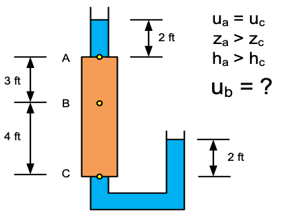

# Exercise - Head Calculations

Consider the following cylinder of soil. There is a standpipe filled with 2 ft of water connected to point A and a standpipe with 2 ft of water above the exit point at C. Using the principles of hydraulic head, calculate the pore pressure at point B. Assume the soil is uniform. 

Excel starter file: [cylinder.xlsx](cylinder.xlsx)

Excel solution: [cylinder_key.xlsx](cylinder_key.xlsx)