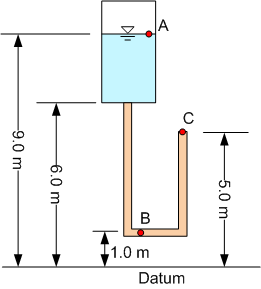

# Homework - Head Calculations

Solve the following problems using Excel or Google Sheets. Show all of your work and calculations. 

1. A piezometer is placed in the ground at a site. The screen on the piezometer is at a depth of **172.7** ft. The 
elevation of the ground surface where the piezometer is located is **2193.0** ft above mean sea level. The pore pressure measured by the piezometer is **38.4** psi. Assume that sea level is the datum. At the location of the piezometer screen:

     a) What is the elevation head? [ft]
     
     b) What is the pressure head? [ft]
     
     c) What is the total head? [ft]

   2. The figure below shows a pressurized reservoir with the water level at point A.  The discharge is into the atmosphere at point C. The connecting pipe is of constant diameter with a cross-section of **0.02** m^2 and is filled with a sand with hydraulic conductivity of **0.015** m/s.  The average length of the pipe is **9.0** m.  Point B is exactly halfway along the length of the pipe.  The discharge at C is **0.0001** m3/s.  

       

       Compute the following:

       a) The head loss from A to C.
    
       b) The total head at A.
    
       c) The pressure head at A.
    
       d) The total head at B.
    
       e) The pressure head at B
    
       f) Is there flow from a region of low pressure to a region of high pressure? Where and why?
    
       g) What would happen to the heads and discharge if the hydraulic conductivity of the medium decreased to 0.001m/s assuming that the water levels and pressures remain constant?

## Submission

Save your work in a file named `head_hw.xlsx` and submit it on Learning Suite.