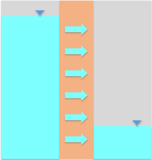

# Exercise - Darcy's Law

# Part 1 - Clay Liner

A 3-ft thick compacted clay liner is to be constructed at the bottom of a municipal waste landfill as shown below. The objective of the liner is to prevent leachate from escaping the landfill and contaminating the nearby groundwater. Even though the landfill has a leachate collection and drainage system, we will assume that leachate may pond to a max height of 1 ft.

You have been asked to perform an analysis of the potential seepage of the leachate. The landfill covers an area that is roughly 10 acres in size.  Assuming that the vertical hydraulic conductivity of the landfill = 1e-7 cm/s, answer the following:

a) how much leachate would potentially escape the landfill each day? 
b) Assuming ne = 0.2, what is the travel time [yrs] for the leachate to move through the liner?

Excel starter file: [clayliner.xlsx](clayliner.xlsx) 
Excel solution: [clayliner_key.xlsx](clayliner_key.xlsx)

# Part 2 - Flow Through a Slurry Wall

A slurry wall is a type of wall used to prevent groundwater from entering or leaving a site. The wall is constructed by digging a trench and filling it with a slurry of bentonite and water. The bentonite forms a barrier that is impermeable to water. The trench is then filled with concrete to provide structural support. 

A 3-ft wide by 20-ft deep slurry trench cutoff wall has been constructed as a flow barrier. After the wall was installed and the flow was allowed to equilibrate, the water table elevation on the left was measured at 2 ft below the ground surface. On the right, it was measured at a depth of 16 ft. The hydraulic conductivity of the wall is estimated to be 1e-6 cm/sec. Assume simple one-dimensional flow from left to right through the 18-ft high section of the wall in contact with the water.

a) Calculate the amount of water flowing through a 1 ft thick section of the wall (ft^3/day). 
b) Calculate the travel time for water flowing through the wall. Assume ne = 0.3.

Excel starter file: [slurrywall.xlsx](slurrywall.xlsx) 
Excel solution: [slurrywall_KEY.xlsx](slurrywall_KEY.xlsx)

!!! Note
    This is not the correct way to analyze flow through a rectangular section like this. We will learn a more accurate method (Dupuit Equation) later in the semester. However, this is a simple solution that is conservative (flow estimate is high).