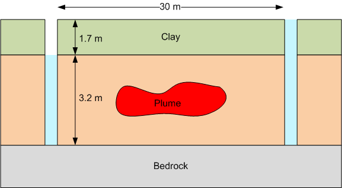

# Homework - Darcy's Law

Solve the following problems using Excel or Google Sheets. Show all of your work and calculations.

1. The water level in an observation well A is measured at **3785.4** ft. At a point **1238** ft downgradient from that point, the water level in a second well (B) is measured at **3629.3** ft.

    a) What is the hydraulic gradient between the well A and well B?
    
    b) Assuming that the hydraulic conductivity is **3.0** ft/day and the effective porosity is **0.3**, what is the seepage velocity between the two points? [ft/day]
    
    c) How long would it take for a particle to travel from point A to point B? [days]

   2. At a site owned by Company X, it is decided to remediate a plume using a double trench system as shown below. A 
      plume lies between the two trenches in a sand layer that is capped by a relatively impermeable clay layer. 
      Nutrient and oxygen laden water will be injected in the trench on the right. The water will flush from right 
      to left and be pumped out of the left trench. To ensure maximum biodegradation, it is best if the sand layer 
      stays saturated. Thus, the trench on the left will be pumped just enough to keep the sand layer saturated. The 
      trench on the right will be kept as full as possible. For the sand layer, assume than n = **0.35** and k = 
      **0.01** cm/s.

      

      a) For a one meter thick slice of the sand layer, how much water would need to be pumped to flush through one 
      pore volume**?
   
      b) How long would it take (in days) to pump **5** pore volumes of water through the sand?

      ** A `pore volume` is a common term used in analysis of site remediation projects involving flushing. A pore volume is 
      defined 
      as the total volume of the voids in the region being flushed. So when you flush "five pore volumes" it means that you have flushed enough water to displace all the water in the voids five times. To find the pore volume, calculate the total volume of the region being flushed and multiply by the porosity.

## Submission

Save your work in a file named `darcy_hw.xlsx` and submit it on Learning Suite.