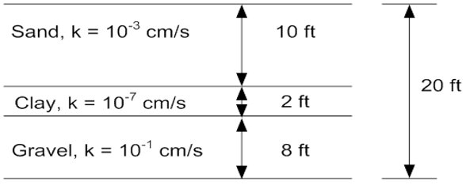
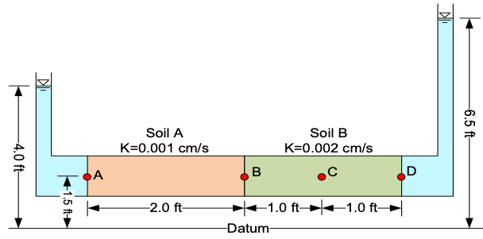

# Exercise - Flow Through Layered Systems

## Part 1 - Layered Soils

Consider the following set of layered soils.

{width=500px}

Calculate the equivalent hydraulic conductivity (Keq) and flow (q) in both the vertical and horizontal directions. Use the following equations:

$$
k_{eq}(parallel) = \frac{\sum_{i=1}^{n}k_iH_i}{\sum_{i=1}^{n}H_i} \hspace{1cm} k_{eq}(perp) = \frac{\sum_{i=1}^{n}H_i}{\sum_{i=1}^{n}\frac{H_i}{k_i}}
$$

$$
q=k\frac{\Delta h}{L}A \hspace{1cm} \Delta h = \frac{qL}{kA}
$$

Assume the following:

| variable     | value |units|
|--------------|-------|---|
| Driving head | 5     |ft|
| Width (dx)   | 100   |ft|
| Height (dy)  | 20    |ft|

Excel starter file: [layers.xlsx](layers.xlsx)

Excel solution: [layers_KEY.xlsx](layers_KEY.xlsx)

## Part 2 - Two Soils in a Cylinder

Consider the following set of soils in a cylinder.

Calculate the total head, elevation head, pressure head, and pore water pressure at points A, B, C, and D.

Excel starter file: [twosoils.xlsx](twosoils.xlsx)

Excel solution: [twosoils_KEY.xlsx](twosoils_KEY.xlsx)