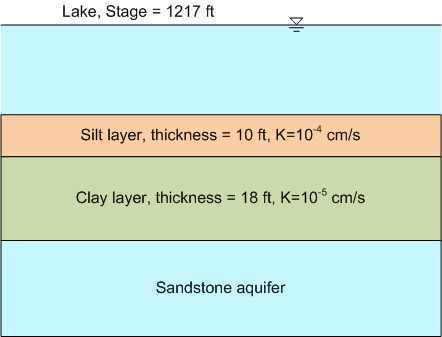

# Homework - Darcy's Law, Layered Systems

Solve the following problems using Excel or Google Sheets. Show all of your work and calculations.

1. A small irrigation reservoir is built on a relatively permeable deposit of sandy soil. To improve the holding 
   capacity of the reservoir, a compacted clay liner is constructed on the bottom of the reservoir. The stage in the reservoir averages about **1020.5** m. The average depth of the reservoir is about **5** m. The clay liner has a thickness of **1** m. The area of the reservoir is about **8000** m^2. After accounting for inflow and outflow and evaporation, it appears that about **1000** m^3 of water is lost from the reservoir each month (every **30** days) due to leakage through the liner. Assume that there is free gravity drainage into the underlying soil beneath the liner (head = elevation at the bottom of the liner).

    a. What is the volumetric flow rate representing the drainage through the liner [m^3/d]?
    
    b. What is the hydraulic gradient through the liner?
    
    c. What is the vertical hydraulic conductivity of the clay liner [cm/s]?

2. Suppose the owners of the reservoir described in the previous problem decide to drain the reservoir and put down a thin pre-fabricated bentonite mat on top of the compacted clay liner to improve the performance of the liner. The bentonite mat is **1.0** cm thick when fully hydrated and the hydraulic conductivity of the bentonite is **1.0e-8** cm/s.

    a. What is the equivalent hydraulic conductivity of the new liner system (clay + bentonite mat) [cm/s]?
    
    b. How much water would be lost per month with the new liner system [m^3]?

3. A lake lies above an aquifer as shown below. Water is draining from the lake to the aquifer through the silt and clay layers. When an observation well is inserted in the aquifer, water rises to **1205.2** ft.  Compute how many cubic feet of water are lost in one year from the lake to the aquifer per square foot of the lake bottom.

    

4. For the previous problem, calculate the pore pressure [psi] at the interface between the silt and clay layers. Assume that the elevation at the top of silt layer = **1182** ft.

## Submission

Save your work in a file named `darcy_layered_hw.xlsx` and submit it on Learning Suite.

## Grading Rubric

Self-grade your assignment using the following rubric. Enter your points in the comment section for the assignment on Learning Suite.

| Criteria                                    | Points |
|---------------------------------------------|:------:|
| Completed on time and all or mostly correct |   3    |
| Completed more than half of assignment      |   2    |
| Made an effort                              |   1    |
| Did nothing                                 |   0    |