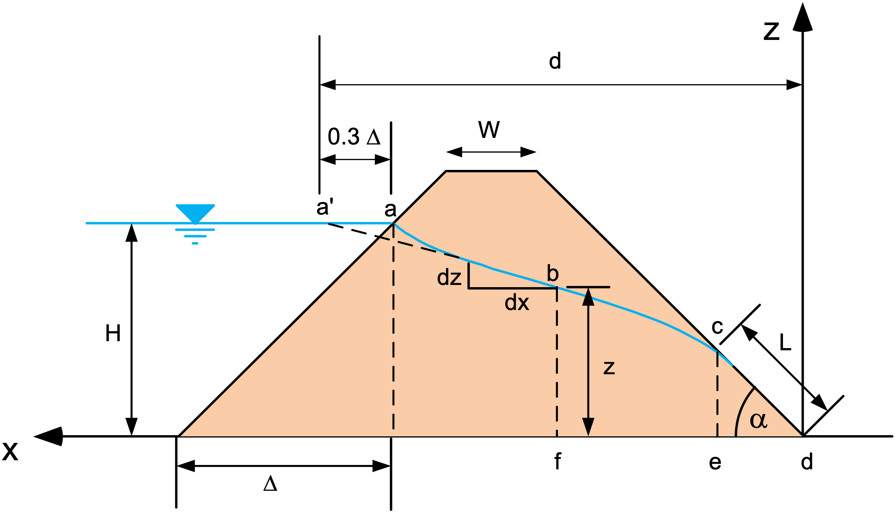

# Exercise - Analytical Solutions

## Part 1 - Dupuit Problem

Consider the following profile representing the classic Dupuit problem with a rectangular cross-section:

The flow through the section is given by:

$$
Q = K \frac{\left(H_o^2 - H_D^2\right)}{2D}
$$

And the head (h) as a function of x is given by:

$$
h = \sqrt{\frac{\left(H_o^2 - H_D^2\right)}{2D} x + H_o^2}
$$

Assume following parameters:

<table style="width: 30%;">
  <tr>
    <th style="width: 33%;">Parameter</th>
    <th style="width: 33%;">Value</th>
    <th style="width: 33%;">Units</th>
  </tr>
  <tr>
    <td>K</td>
    <td>0.001</td>
    <td>cm/s</td>
  </tr>
  <tr>
    <td>D</td>
    <td>100</td>
    <td>m </td>
  </tr>
  <tr>
    <td>\(H_o\)</td>
    <td>5</td>
    <td>m </td>
  </tr>
  <tr>
    <td>\(H_D\)</td>
    <td>1</td>
    <td>m </td>
  </tr>
</table>

Calculate the flow rate (Q) and generated a plot of the head (h) as a function of x for the parameter values given above.

### Excel Solution

Excel starter file: [dupuit.xlsx](dupuit.xlsx)

Excel solution: [dupuit_KEY.xlsx](dupuit_KEY.xlsx)

### Python Solution

Python starter file: 

Python solution: 
 
## Part 2 - Flow Through an Earth Dam

Consider the following profile representing the flow through an earth dam:

The flow through the section is given by:

$$
q = k L tan(\alpha) sin(\alpha)
$$

where:

$$
L = \frac{d}{cos(\alpha)}-\sqrt{\frac{d^2}{cos^2(\alpha)}-\frac{H^2}{sin^2(\alpha)}}
$$

Solve for the flow rate (q) using the set of parameters contained in the following Excel file.

Excel starter file: [earthdam.xlsx](earthdam.xlsx)

Excel solution: [earthdam_KEY.xlsx](earthdam_KEY.xlsx)
