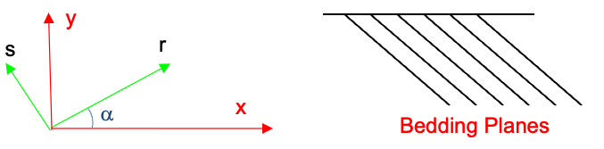

# Exercise - Darcy's Law in 2D

Assume you have a 2D domain with bedding planes declining at a sharp angle as shown below. 

Recall the following equations:

$$
k_{xx} = k_r cos_{\alpha}^2 + k_s sin_{\alpha}^2
$$

$$
k_{yy} = k_r sin_{\alpha}^2 + k_s cos_{\alpha}^2
$$

$$
k_{xy} = k_{yx} = -\frac{1}{2}\left(k_r - k_s\right) sin(2\alpha)
$$

Assume the following:

| variable | value | units |
|----------|-------|-------|
| \(k_s\)  | 0.001 | cm/sec|
| \(k_r\)  | 0.005 | cm/sec|
| \(\alpha\) | -60 | degrees|

(a) Calculate the hydraulic conductivity tensor for the given domain assuming \(\alpha\) = -60 degrees.

(b) Let alpha range from 0 to -90 degrees. Calculate and plot $k_{xx}$ and $k_{yy}$ as a function of $\alpha$.

Excel starter file: [darcy2d.xlsx](darcy2d.xlsx)

Excel solution: [darcy2d_KEY.xlsx](darcy2d_KEY.xlsx)

Python starter file: 

Python solution: 