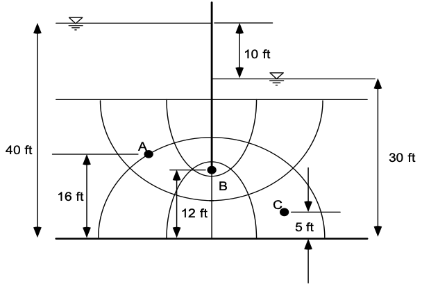
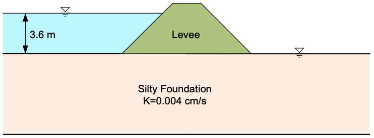

# Exercise - Flownets

## Part 1 - Flownet Calculations

In this exercise, you will apply the principles we have learned about flownets to calculate the total flow rate through the following section of soil that is partially penetrated by a steel sheetpile. You will also calculate the pore pressures at selected locations.

The soil section is shown below:

a) Calculate the total flow rate in ft^3/day through the soil section. Assume k = 0.0001 cm/s. Recall that:

\[q=k\frac{n_f}{n_e}h\]

where:

\(q\) = flow rate (ft^3/day) 
\(k\) = hydraulic conductivity (ft/d) 
\(n_f\) = number of flow channels crossing a given flow line 
\(n_e\) = number of equipotential lines crossing a given flow line 
\(h\) = head difference between two adjacent flow lines (ft)

b) Calculate the total head, elevation head, pressure head, and pore pressure at points A, B, and C. 

Excel starter file: [flownet_calcs.xlsx](flownet_calcs.xlsx)

Excel solution file: [flownet_calcs_KEY.xlsx](flownet_calcs_KEY.xlsx)

## Part 2 - Flownet Construction

In this exercise, you will manually construct a flownet for flow through a silty soil layer underlying a levee as 
shown below:

a) Construct a flownet for the system using the powerpoint file provided below. Use the MS Office drawing tools to 
draw the flownet. Use the principles we have learned in class to construct the flownet.

b) On the last sheet of the powerpoint file, calculate the flow rate through the silty soil layer. Show your 
calculations on the powerpoint slide.

Starting powerpoint file: [levee_flownet.pptx](levee_flownet.pptx)

Solution powerpoint file: [levee_flownet_KEY.pptx](levee_flownet_KEY.pptx)
