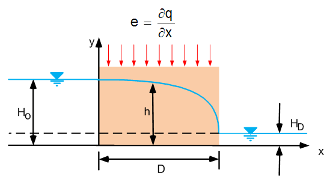

# Homework - Analytical Solution to Profile Model

In class we discussed the Dupuit problem with an infiltration term (e):

The equation for the flow rate as a function of x is:

$$
Q = k\frac{\left(H_o^2-H_D^2\right)}{2D}-e\left(\frac{D}{2}-x\right)
$$

Derive an equation for h in terms of x. Start with:

$$
h^2 = -\frac{e}{k}x^2 + C1x + C2
$$

and insert the left and right boundary conditions and solve for C1 and C2. Solve the resulting equation for h.

Put your solution in a word document and show each of your steps. Or you can derive on paper and submit a scan or photo of your work.

Once you have found your equation for h, created a modified version of the solution to the Dupuit problem that we did in class that uses your new equation for h. You can do it in Python or Excel. 

Excel starter file: [dupuit_with_recharge.xlsx](dupuit_with_recharge.xlsx)

Python starter file: 

## Submission

Submit your Word document with your derivation and your Excel file or a link to your Colab notebook in Learning Suite. Upload your files after we grade the homework together in class.

## Grading Rubric

Self-grade your assignment using the following rubric. Enter your points in the "Submission notes" section for the assignment on Learning Suite when you upload your files. You can use fractional points if you like (e.g. 2.5).

| Criteria                                    | Points |
|---------------------------------------------|:------:|
| Completed on time and all or mostly correct |   3    |
| Completed more than half of assignment      |   2    |
| Made an effort                              |   1    |
| Did nothing                                 |   0    |