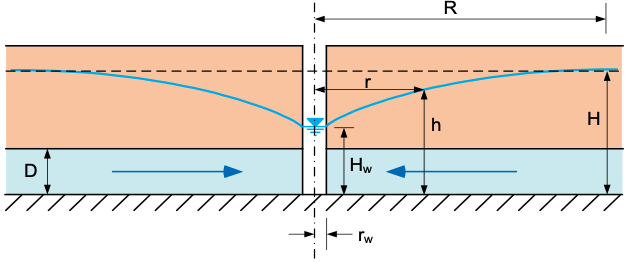
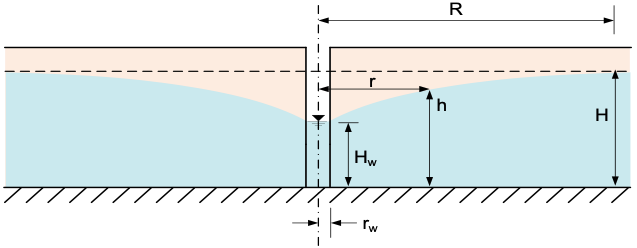

# Exercise - Well Equations

## Part 1 - Radius of Influence

The radius of influence of a well is the distance from the well at which the drawdown is negligible. The radius of influence can be estimated using the following equations:

| Name      | Type | Equation                         |
|-----------|------|----------------------------------|
| Lembke    |Semi-Empirical| $R = H\sqrt{\frac{k}{2N}}$       | 
| Weber     | Semi-Empirical | $R = 2.45\sqrt{\frac{Hkt}{n_e}}$ |
| Kusakin   | Semi-Empirical | $R = 1.9\sqrt{\frac{Hkt}{n_e}}$  |
| Siechardt | Empirical | $R = 3000s_w\sqrt{k}$            |
| Kusakin   | Empirical | \(R = 575s_w\sqrt{\frac{H}{k}}\) |

Where:

>>H = initial thickness (B for confined aquifers, h for unconfined aquifers) [m] 
k = hydraulic conductivity [m/sec] 
$s_w$ = drawdown at the well [m] 
\(n_e\) = effective porosity (storativity S, for confined) [-] 
t = time since pumping began [sec] 
N = accretion from rainfall [m/sec]

The following spreadsheet a sample set of calculations for each of the equations above.

Excel file: [radius_of_influence.xlsx](..%2F07_analytical%2Fradius_of_influence.xlsx)

## Part 2 - Confined Aquifer

In this exercise, you will calculate the water level at the center of the well and as a function of distance from the well for a confined aquifer.

The following equations can be used to calculate the head (h) as a function of distance (x) from the well:

$$
h =  H = \frac{q}{2\pi k D} \ln\left(\frac{r}{R}\right)
$$

Where:

>>h = head [L] 
H = initial head prior to pumping [L] 
q = flow rate [L³/T] 
k = hydraulic conductivity [L/T] 
D = thickness of the confined aquifer [L] 
r = distance from the well [L] 
R = radius of influence of the well [L]

Assume the following values for the confined aquifer:

| Parameter | Value | Units |
|-----------|-------|-------|
| H         | 50    | m     |
| Q         | 0.2   | m³/s  |
| k         | 1e-3  | m/s   |
| D         | 15    | m     |
| R         | 500   | m     |
| \(r_w\)   | 0.1   | m     |

a) Calculate the head at the center of the well (r = \(r_w\)).

b) Let r vary from rw to R. Calculate and plot the head as a function of distance (r) from the well.

Excel starter file: [confined.xlsx](confined.xlsx)

Excel solution file: [confined_KEY.xlsx](confined_KEY.xlsx)

Python starter file: 

Python solution file:  

## Part 3 - Unconfined Aquifer

In this exercise, you will calculate the water level at the center of the well and as a function of distance from the well for an unconfined aquifer.

The following equations can be used to calculate the head (h) as a function of distance (x) from the well:

$$
h =  \sqrt{H^2 - \frac{q \ln\left(\frac{R}{r}\right)}{\pi k} }
$$

Where:
h = head [L] 
H = initial head prior to pumping [L] 
q = flow rate [L³/T] 
R = radius of influence of the well [L] 
r = distance from the well [L] 
k = hydraulic conductivity [L/T] 

Assume the following values for the unconfined aquifer:

| Parameter | Value | Units |
|-----------|----|-------|
| Q         | 0.2 | m³/s  |
| k         | 1  | cm/s  |
| H         | 50 | m     |
| R         | 500 | m     |
| \(r_w\)   | 0.1 | m     |

a) Calculate the head at the center of the well (r = \(r_w\)).

b) Let r vary from rw to R. Calculate and plot the head as a function of distance (r) from the well.

Excel starter file: [unconfined.xlsx](unconfined.xlsx)

Excel solution file: [unconfined_KEY.xlsx](unconfined_KEY.xlsx)

Python starter file: 

Python solution file:  

