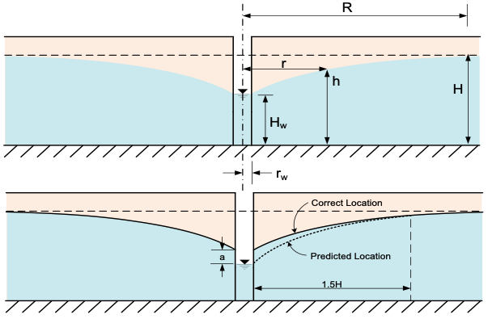
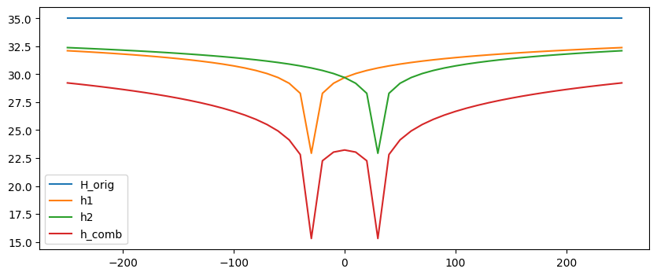

# Homework - Well Equations

**1.** A **12** inch diameter well was installed in a thick layer of sand. The water table was at elevation **2039** ft before pumping of the well began. The well was then pumped at a rate of **30** gallons per minute and the water level in the well dropped to **2014** ft after a steady-state condition was reached. The radius of well influence is **2000** ft. The elevation of the bottom of the sand layer = **2000** ft.

a. Calculate the permeability of the sand [ft/day] assuming the aquifer is **confined** and D = **10** ft.

b. Calculate the permeability of the sand [ft/day] assuming the aquifer is **unconfined**.

**2.** The Dupuit assumptions used to derive the unconfined aquifer well equation results in an inaccurate estimate of 
   the drawdown at the well and out to a distance from the well as shown below:

The correction factor is given by:

$$
h' = h + a
$$

$$
h =  \sqrt{H^2 - \frac{q \ln\left(\frac{R}{r}\right)}{\pi k} }
$$

$$
a = \frac{\left(H'-H_w\right)\left[1-\left(\frac{H_w}{H'}\right)^{2.4}\right]}{7.2 \left(1+\frac{5 r_w}{H}\right)}
$$

Where:

h' = corrected head [L] 
h = head [L] 
H = initial head prior to pumping [L] 
q = flow rate [L³/T] 
R = radius of influence of the well [L] 
r = distance from the well [L] 
k = hydraulic conductivity [L/T] 
\(r_w\) = radius of the well [L] 
H' = height of drawdown surface at r = 500\(r_w\) [L] 

Assume the following values for the unconfined aquifer:

| Parameter | Value | Units |
|-----------|-------|-------|
| Q         | 0.2   | m³/s  |
| k         | 0.05  | cm/s  |
| H         | 50    | m     |
| R         | 500   | m     |
| \(r_w\)   | 0.1   | m     |

a. Calculate the head at the center of the well (r = \(r_w\)) using the corrected head equation.

b. Let r vary from rw to R. Calculate and plot the head as a function of distance (r) from the well using the 
corrected head equation. Start with the full correction from part (a) and assume a linear decrease in the correction 
term out to a value of zero at r = 1.5*H. Plot the head with and without the correction term out to a limit of r = 150 m.

Excel starter file: [correction.xlsx](correction.xlsx)

Python starter file: 

**3.** Two wells are installed a distance of **60** feet apart in an unconfined aquifer **40** feet thick. The water table is **5** 
feet below the ground surface. The hydraulic conductivity of the aquifer is **0.02** ft/min. The following information is also known for the wells:

Radius of well influence: **3000** ft 
Diameter of well: **6** inches 
Pumping rate per well: **35** gallons per minute per well

Compute and plot the drawdown surface produced by pumping the two wells under steady state conditions. Use a 
cross-section which passes through both wells. Do not use the "a" term to correct the drawdown. Let x range from 
-250 to +250 ft with increments of 10 ft assuming x=0 exactly halfway between the wells. At each x location, 
calculate the distance from x to each well (r1 and r2). Then calculate  and head for each well independently (h1 
and h2) using the unconfined aquifer well equation:

$$
h =  \sqrt{H^2 - \frac{q \ln\left(\frac{R}{r}\right)}{\pi k} }
$$

Finally, calculate the head resulting from both wells pumping simultaneously (h_comb) using the superposition equation:

$$
h = \sqrt{H^2 - \frac{1}{\pi k}\sum_{i=1}^n{q_i \ln\left(\frac{R}{r_i}\right)}}
$$

Combine the original head, h1, h2, and h_combined all on the same plot. If you have done it correctly, it should 
look something like this:

Solve in either Excel or Python.

Excel starter file: [two_wells.xlsx](two_wells.xlsx)

Python starter file: 

## Submission

Combine your spreadsheets and links to your Python notebooks into a single zip archive and submit it to Learning Suite.
