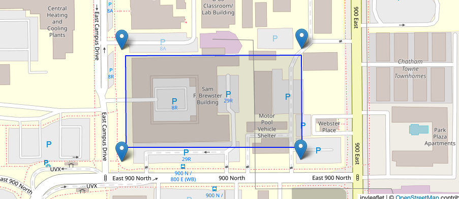
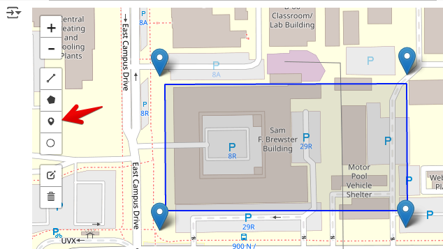

# Exercise - Construction Dewatering

In this exercise, we will use a Python script in a Google Colab notebook to design a well-based dewateirng system for a construction site. The script will calculate the well spacing and pumping rate required to lower the water table to a desired level. We will assume unconfined conditions and apply the superposition principle to calculate the drawdown at the well using the following equation:

$$
h = \sqrt{H^{2} - \frac{1}{\pi k} \sum_{i=1}^n q_{i}ln\left(R/r\right)}
$$

Where:

>>$h$ = water level at a given location (m) 
$H$ = initial water table elevation (m) 
$k$ = hydraulic conductivity of the aquifer (m/s) 
$q_{i}$ = pumping rate of well $i$ (m³/s) 
$R$ = distance from the well to the observation point (m) 
$r_i$ = distance from the well $i$ to the point in question (m) 
$n$ = number of wells

This assumes we have a simple, uniform isotropic aquifer underlain by a low K unit. The heads are measured from the top of the low K unit. 

When dealign with an excavation, we can create a grid of points that covers the excavation and then calculate the drawdown at each point resulting from a set of dewatering wells that surround the excavation. At each point, we calculate the separation distance ($r_i$) from each well to the point and apply the equation above to get the water level. The well spacing and pumping rate can be adjusted to achieve a condition where the water level at all points inside the excavation are below the target depth of the excavation.

The following Colab notebook has been designed to help you calculate the well spacing and pumping rate required to dewater a construction site. The notebook is divided into sections that guide you through the process of calculating the drawdown at each point in the grid and visualizing the results. The notebook also includes interactive widgets that allow you to adjust the well spacing and pumping rate and see the results in real-time. 

To get started, click the "Open in Colab" button below and follow the instructions in the notebook.

Python starter file: 

Before starting, we need to define the location of our excavation. The excavation size and location are specified using GeoJSON file. To create a geojson file of a region of interest, go here:

[https://geojson.io/#map=2.85/32.25/-98.07](https://geojson.io/#map=2.85/32.25/-98.07){:target="_blank"}

and zoom in on a region of interest. Then use the draw polygon tool to draw your region. When you are done, select the Save option and save your polygon to a geojson file.

For this problem, we will use the following GEOJSON file:

GEOJSON File: [byu_brewster.geojson](byu_brewster.geojson)

This file contains the coordinates of a polygon that represents the excavation site. For this problem we will assume 
that BYU intends to build a new building to replace the Clyde Building and has decided to build the new building at 
the location of the current Brewster Building on the east side of campus. The GEOJSON file contains the coordinates 
of a rectangular excavation site that represents the footprint of the new building. The following image shows the location of the excavation site on the BYU campus:

The goal of this exercise is to design a dewatering system that will lower the water table below the bottom of the excavation. The following parameters are provided for the problem:

| Parameter | Value | units |
|----------|------|-------|
| $H$      | 40   | m     |
| $k$      | 5e-4 | cm/s  |
| $Q$      | 0.01 | m³/s  |
| $R$      | 500  | m     |
| Design H | 35   | m     |

Launch the notebook using the link above. You will upload the GEOJSON file using the upload button that will appear when you run one of the first cells in the notebook. Once you have uploaded the GEOJSON file, following the remaining instructions in the notebook.

## Part 1 - Manual Well Spacing

In the first part of the notebook, you will interactively create wells by using the point tool shown below to create 
points corresponding to the well locations shown by the blue symbols.

The total pumping rate is then divided equally among the wells. The drawdown at each point is calculated using the 
equation above and the well locations displayed on the map. Play with the number and spacing of the wells and the 
total pumping rate to see how the drawdown changes. Use the plotting tools in the notebook to visualize the results 
and determine when the drawdown is below the target depth of the excavation at all points.

## Part 2 - Automated Well Spacing

In the second part of the notebook labelled **Rectangular Well Design**, you will use an algorithm to automatically 
place a line of wells around the perimeter of the excavation based on an offset distance from the excavation 
boundary and a specified well spacing. The notebook also includes an algorithm to calculate the pumping rate 
required to achieve the target drawdown at all points inside the excavation. 

!!! Note
    An excavation at this location would not likely require dewatering as the water table is well below the 
    elevation of the site. This is for illustrative purposes only.