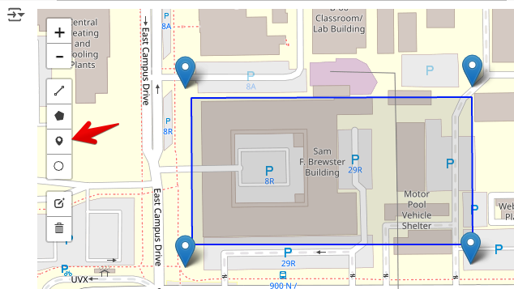
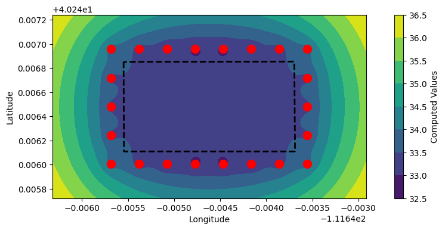
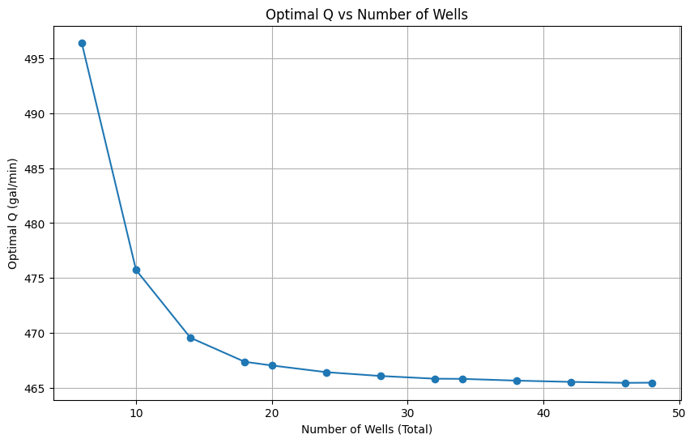

# Exercise - Construction Dewatering

In this exercise, we will use a Python script in a Google Colab notebook to design a well-based dewateirng system for a construction site. The script will calculate the well spacing and pumping rate required to lower the water table to a desired level. We will assume unconfined conditions and apply the superposition principle to calculate the drawdown at the well using the following equation:

>>$h = \sqrt{H^{2} - \dfrac{1}{\pi k} \sum_{i=1}^n q_{i}ln\left(R/r\right)}$

Where:

>>$h$ = water level at a given location (m) 
$H$ = initial water table elevation (m) 
$k$ = hydraulic conductivity of the aquifer (m/s) 
$q_{i}$ = pumping rate of well $i$ (m³/s) 
$R$ = distance from the well to the observation point (m) 
$r_i$ = distance from the well $i$ to the point in question (m) 
$n$ = number of wells

This assumes we have a simple, uniform isotropic aquifer underlain by a low K unit. The heads are measured from the top of the low K unit. 

When dealign with an excavation, we can create a grid of points that covers the excavation and then calculate the drawdown at each point resulting from a set of dewatering wells that surround the excavation. At each point, we calculate the separation distance ($r_i$) from each well to the point and apply the equation above to get the water level. The well spacing and pumping rate can be adjusted to achieve a condition where the water level at all points inside the excavation are below the target depth of the excavation.

The following Colab notebook has been designed to help you calculate the well spacing and pumping rate required to dewater a construction site. The notebook is divided into sections that guide you through the process of calculating the drawdown at each point in the grid and visualizing the results. The notebook also includes interactive widgets that allow you to adjust the well spacing and pumping rate and see the results in real-time. 

To get started, click the "Open in Colab" button below and follow the instructions in the notebook.

Python starter file: 

## Part 1 - Define the Excavation Site and Create Wells (Setup)

In the first part of the notebook, you will interactively create points on a map corresponding to the locations of 
the dewatering wells. The wells are placed around the perimeter of the excavation site. Therefore, we need to first 
define the location of our excavation. The excavation size and location are specified using GeoJSON file. 

In general, to create a geojson file of a region of interest, you can go here:

[https://geojson.io/#map=2.85/32.25/-98.07](https://geojson.io/#map=2.85/32.25/-98.07){:target="_blank"}

and zoom in on a region of interest. Then use the draw polygon tool to draw your region. When you are done, you 
can select the Save option and save your polygon to a geojson file. However, for this problem, we will use the following GEOJSON file:

GEOJSON File: [byu_brewster.geojson](byu_brewster.geojson) (right-click and select "Save Link As")

This file contains the coordinates of a polygon that represents an excavation site. For this problem we will assume that BYU intends to build a new building to replace the Clyde Building and has decided to build the new building at the location of the current Brewster Building on the east side of campus. The GEOJSON file contains the coordinates 
of a rectangular excavation site that represents the footprint of the new building. 

!!! Note
    An excavation at this location would not likely require dewatering as the water table is well below the 
    elevation of the site. This is for illustrative purposes only.

Follow the instructions in part 1 of the the notebook to upload the GEOJSON file and visualize the excavation site. You 
will then interactively create wells by using the point tool shown below to create 
points corresponding to the well locations shown by the blue symbols.

If you need to change the locations of the wells, the easiest way is to delete the existing wells and create new ones using the two cells below the map.  

## Part 2 - Drawdown Calculations

The goal of this exercise is to design a dewatering system that will lower the water table below the bottom of the 
excavation. In this step, we will use the wells defined above to calculate the drawdown at each point in a grid 
coverting the site and visualize the results. 

Run the code in this section to define the functions, and then enter the following parameters for the site:

| Parameter | Value | units |
|----------|-------|-------|
| $k$      | 5e-4  | cm/s  |
| $H$      | 50    | m     |
| $R$      | 500   | m     |
| Design H | 35    | m     |
| $Q$      | 0.015 | m³/s  |

The total pumping rate you enter is divided equally among the wells. Run the cells to create a grid of points that surround the excavation and calculate the head at each point in the grid. You can then generate a series of contour plots showing head/drawdown resulting from the well configuration and the pumping rate. Play with the pumping rate and the plotting tools in the notebook to visualize the results and determine when the drawdown is below the target depth of the excavation at all points.

## Part 2 - Rectangular Well System Design

In the next part of the notebook labelled **Rectangular Well System Design**, you will use an algorithm to automatically 
place a line of wells around the perimeter of the excavation based on an offset distance from the excavation 
boundary and a specified well spacing. The results should look something like the image below:

Play with the number of wells, the offset distance, and the pumping rate. Compare your results to the previous section 
where you manually placed the wells.

## Part 4 - Pumping Rate Optimization

In the next part of the notebook labelled **Pumping Rate Optimization**, you will use an optimization algorithm to 
find the optimal pumping rate using the rectangular well system you have designed. The algorithm will 
adjust the total pumping rate to find a minimum value that puts the water level inside the excavation just below the depth of the excavation at all points.

## Part 5 - Q vs NumWells Design Curve

In the final part of the notebook, you will use the optimization algorithm to generate a design curve that shows the 
relationship between the total pumping rate and the number of wells required to dewater the excavation. You will 
give a min and max number of points along the major edge and the code will loop from the min to max number of points.
In each iteration it will generate a rectangular grid of wells around the excavation and then find the optimal pumping 
rate for the configuration. 

Finally, the results are presented in a curve of optimal pumping rate vs number of wells.
The design curve will help you determine the optimal number of wells and pumping rate required to dewater the 
excavation. In other words, at some point, adding more wells will not significantly reduce the pumping rate required to dewater the excavation. Your design curve should look something like this:

