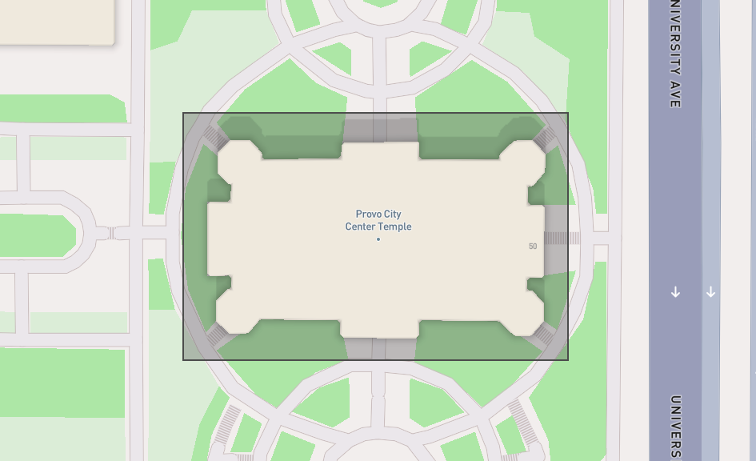

# Homework - Construction Dewatering

In this exercise, we will design a dewatering trench using the Dupuit analytical solution and we will design a 
dewatering system for the Provo City Center Temple excavation site using a Python script in a Google Colab notebook.

## Exercise 1 - Dewatering Trench Design

The Los Pollos Hermanos Corporation is planning to build a new manufacturing facility near the Rio Grande River in the outskirts of Albuquerque, New Mexico. The facility will include a hermetically-sealed underground unit with state-of-the-art ventillation and chemical-processing equipment. In order to dewater the site during construction and to ensure that it stays dry while in operation, the company decides to build a french drain between the river and excavation as follows:

A pump will be attached to the drain and the water will be returned to the river. Calculate what capacity will be required (gpm) for the pump. To simplify your calculations, assume that there is a lower permeability layer at the elevation corresponding to the bottom of the excavation. Use a spreadsheet for your calculations.

!!! Note
    Be careful with the values for Ho and HD in the equation. They should be measured from the datum, which is the bottom of the trench. Don't use the elevations.

## Exercise 2 - Provo City Center Temple Dewatering

The Provo City Center Temple is a temple of The Church of Jesus Christ of Latter-day Saints in Provo, Utah. The 
temple is located on the site of the former Provo Tabernacle, which was destroyed by fire in December 2010, leaving 
only the outer brick facade intact.

The Church of Jesus Christ of Latter-day Saints announced during the October 2011 general conference that the structure 
woud be rebuilt as the 
Provo City Center Temple. This is an architect's rendering of the planned temple:

The engineers in charge of the reconstruction faced a difficult task. As a temple, the structure would need to have a basement to house a baptismal font. Furthermore, there was a need to ensure that the reconstructed building is supported by an adequate, modern foundation. This would have to be done without damaging the fragile brick facade. To this they designed an elaborate system of piles:

The excavation went down to a depth of 30 feet below the original ground surface. This presented another challenge because the water table in this region is shallow. In order to accomplish the construction, the site had to be dewatered. This is typically accomplished using a set of shallow wells where each well lowers the water table and creates a "cone of depression" surrounding the well. Multiples wells provide a combined effect resulting in an aggregate zone of drawdown.

Our objective in this exercise is to design a dewatering system using the Google Colab notebook we used for the 
in-class exercise. The notebook is available at the following link:

Python starter file: 

**(a)  Setup Problem**

Before starting, download the following GEOJSON file:

GEOJSON File: [temple.geojson](temple.geojson) (right-click and select "Save Link As")

This represents the footprint of the excavation:

Run the cells to upload the file and visualize the excavation site. You will then interactively create wells by using the point tool to create points corresponding to the well locations. Start by creating 2 wells.

**(b)  Drawdown Calculations and Manual Design**

Assume the following parameters for the problem:

| Parameter | Value | units  |
|----------|-------|--------|
| $k$      | 0.007 | cm/sec |
| $H$      | 30    | m      |
| $R$      | 400   | m      |
| Design H | 25    | m      |
| $Q$      | 0.025 | m³/s   |

Enter these values and run the cells to calculate the drawdown at each point in a grid covering the site and visualize the results with the contour plot options.

Now design a dewatering system under three conditions: 2 wells, 4 wells, and 6 wells. In each case, 
assume that the you can only place the wells outside of the temple footprint. You should change the location of the wells and the total pumping rate. To change the location of the wells, run the optional cell just under the map to delete your prior set of wells and create new wells and then run the following sequence of cells to generate the drawdown map.

Save a copy of each of your designs. Right-click on one of the contour plots showing the water level or head difference inside the excavation and click "Save Image As". Open a Word document and write a short section for each of your three designs (including the contour plots) and discuss the results. Indicate which of the three designs you would suggest using for the actual project.

**(c) Rectangular Well System Design**

Next, use the algorithm that automatically places a line of wells around the perimeter of 
the excavation based on an offset distance from the excavation boundary and a specified well spacing. Use an offset 
of 20m and 8 points along the x-direction.  

**(d) Pumping Rate Optimization**

For the rectangular well system, use the optimization algorithm to find the optimal pumping rate that will dewater the site with the well configuration described above. Save a copy of the contour plot showing the drawdown and include it in your report along with your pumping rate in gpm.

**(e) Design Curve**

Finally, run the code in the last section of the notebook to generate a design curve for the well system. Save a copy of the plot and include it in your report. Also indicate how many wells you would recommend using, based on the design curve.

## Submission

Make a zip archive of your spreadsheet for part 1 and your Word document for part 2. Submit the zip archive on Learning Suite after we grade it together in class.

## Grading Rubric

Self-grade your assignment using the following rubric. Enter your points in the "Submission notes" section for the assignment on Learning Suite when you upload your file. You can use fractional points if you like (e.g. 2.5).

| Criteria                                    | Points |
|---------------------------------------------|:------:|
| Completed on time and all or mostly correct |   3    |
| Completed more than half of assignment      |   2    |
| Made an effort                              |   1    |
| Did nothing                                 |   0    |