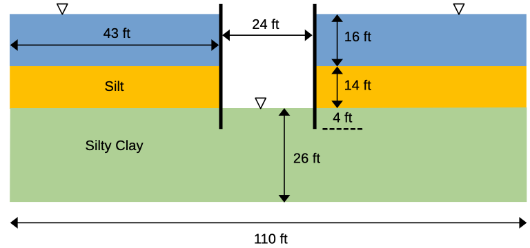
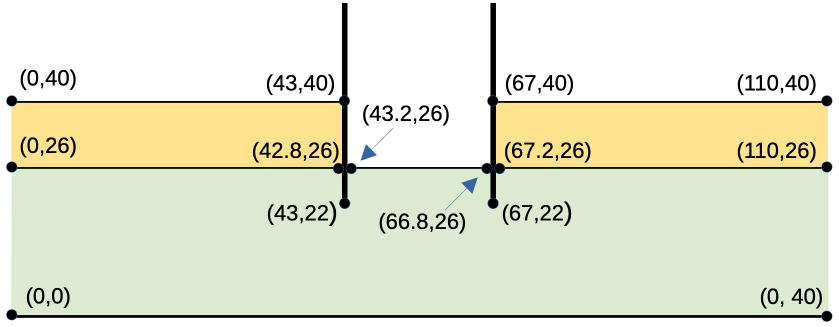

# Exercise - XSLOPE Seepage Analysis

For this exercise, we will perform a pair of seepage analyses using XSLOPE for problem with confined (fully-saturated) 
conditions. For both cases, we will first prepare the problem inputs in an XSLOPE Excel input file starting with the standard template:

[input_template.xlsx](https://xslope.readthedocs.io/en/latest/inputs/input_template.xlsx)

After preparing each input file, launch the following Google Colab notebook to upload the Excel input file and 
perform the seepage analysis:

### 1. Clay Blanket Sheetpile Problem

This problem corresponds to the clay-blanket sheetpile case that we analyzed in our flow net section:

Use the Excel file to specify the material properties, define the geometry using a profile line, and assign 
boundary conditions. As you set up the problem, you will need to define a local coordinate system. Set up your coordinate system as follows:

Solution: [xslope_clay_blanket.xlsx](https://xslope.readthedocs.io/en/latest/seep/files/xslope_clay_blanket.xlsx)

### 2. Sea Trench Problem

The following problem is for a construction project in a harbor that requires that a section of the harbor bottom be exposed by pumping the water out of a trench formed by a pair of parallel sheetpile walls. The sheetpiles pass through an upper silt layer until they penetrate a lower silty clay layer with a lower permeability to a depth of 4 ft. 

The properties of the soil layers are as follows:

| Soil Layer | K1  | K2  |
|:----------:|:---:|:---:|
|    Silt    | 0.5 | 0.5 |
| Silty Clay | 0.1 | 0.1 |

Since this is a fully saturated problem, the kr0 and h0 material parameters are ignored. The problem set up requires 3 profile lines: 1 at the top of the silt layer on the left side, 1 at the top of the silt layer on the right, and 1 at the top of the silty clay layer that goes all the way from the left side to the right side of the problem. This profile line includes a small gap at the location of each sheetpile penetration to create a no-flow boundary along the edge of the sheetpile. 

As you build the problem input, you may wish to use the following coordinates:

Solution: [xslope_sea_trench.xlsx](https://xslope.readthedocs.io/en/latest/seep/files/xslope_sea_trench.xlsx)