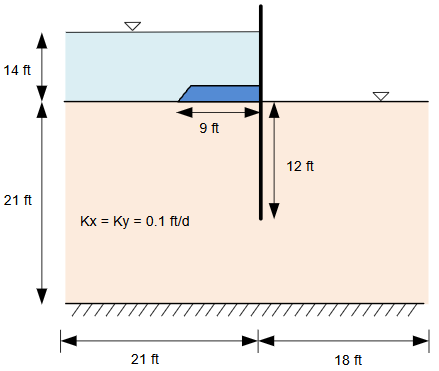
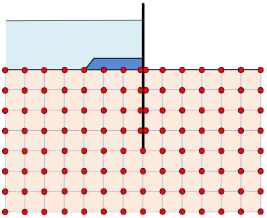
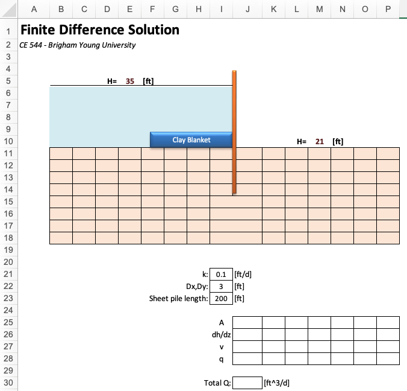

# Exercise - Finite Difference Solution - Clay Blanket Sheetpile

In this exercise, you will implement a finite difference solution to 2D seepage using equations in an Excel file. This problem we will be solving is flow under a sheetpile with a clay blanket on the upstream side of the sheetpile. The problem dimensions and properties are as follows:

To solve this problem, we will set up a grid with a spacing of 3 ft x 3 ft as follows:

To solve the problem, we will use an Excel file set up as follows:

Download a copy of the file here:

Excel starter file: [findiff-1_clayblanket.xlsx](findiff-1_clayblanket.xlsx)

Excel solution file: [findiff-1_clayblankey_KEY.xlsx](findiff-1_clayblanket_KEY.xlsx)

(a) Fill in the salmon-colored cells with the appropriate formulas to solve the problem using the 
equations we discussed in class. You should first apply boundary conditions to the upstrem and downstream sides. 
Then fill in the interior cells using the finite difference equations.

(b) After successfully entering the formulas and iterating, you can use the head values along the exit face to calculate 
the flow rate out of the system. Enter the formulas to calculate the flow rate using the table at the bottom of the 
spreadsheet. Assume k = 0.1 ft/day and the head values are in ft. Assume the sheetpile is impermeable and that it is 
200 ft long.

!!! Note
    You will end up with circular references. Before entering the equations in Excel, select the **Formulas** ribbon, and click on the **Calculation Options** 
    button on the right end of the ribbon and select **Manual**. This will prevent Excel from automatically 
    recalculating. You can select **Calculate Now** from the **Formulas** ribbon to recalculate the sheet or you can 
    hit the **F9** button. Do this repeatedly until you converge.

## To track down minor errors

If you are getting values from your formulas but they don't look right, you can often track down the cells with errors using conditional formatting.
(a) Go to the **Home** tab and click on **Conditional Formatting**.
(b) Select the **Color Scales** option and pick a color scale.
(c) The color gradation should be smooth. If you see a discontinuity, check the associated formula.

## To fix major errors

If you have an error in your equations or if you attempt the calculations before all of the equations are properly entered, you may encounter a situation where the formulas return an error message such as #NUM.  At this point you will be stuck because all of the adjacent formulas will be in error as well. To solve this problem you can try the following:

(a) Select the entire problem domain corresponding to the colored text where you are solving the finite difference equations and copy the equations to the clipboard.

(b)  Paste the entire set of equations at some other location on the spreadsheet such as starting at row **34**.

(c)  For each of the cells that are displaying an error message, type in a new value such as the average of the upstream head of the downstream head. Note that this will overwrite the existing equation. Make sure that when you type a new value in for the cells that are merged underneath the tip of the sheet pile that you don't unmerge the cells.

(d)  Select the entire range that you pasted as part of step (a) and paste them back into the original cells using the **Paste Special/Paste Formulas** command.  When you paste the cells it should automatically trigger recalculation but it will use the new values you entered in step (c). If your formulas are correct this should fix the problem.
