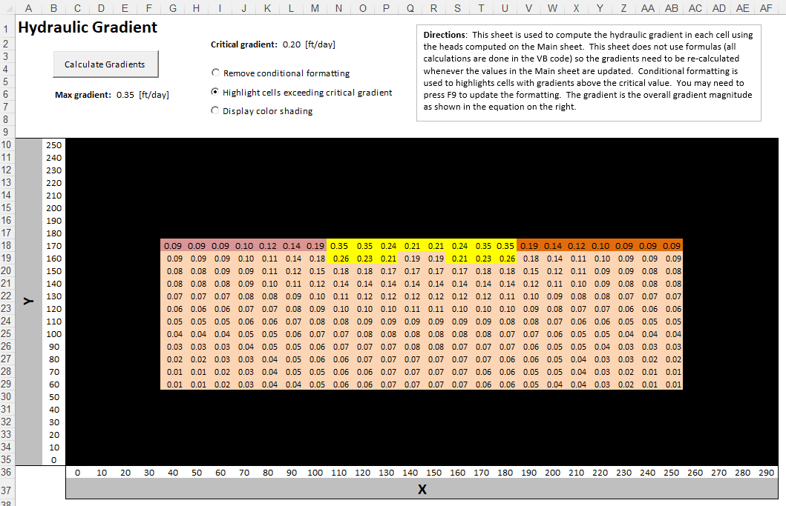
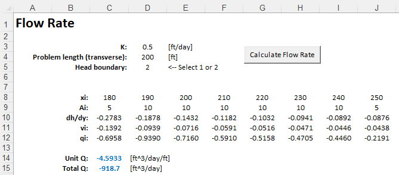
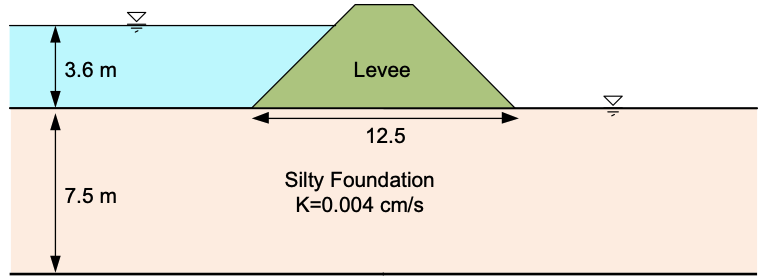

# Finite Difference Solutions - Levee and Excavation

For this exercise, we will use a modified version of the finite difference solution to seepage problems. This 
version uses a script in Visual Basic for Applications (VBA) to to automaticallly create the finite difference 
equations. The script is included in the Excel file that you will download. 

Excel starter file: [findiff-2.xlsm](findiff-2.xlsm)

Note the extension to this file is .xlsm. This indicates that the file contains macros. Furthermore, the file contains ActiveX controls that are used to interact with the user. These are only supposed on Windows versions of Excel. Furthermore, since this file contains a macro, you will need to enable macros in Excel. To do this, do the following:

1. Right-click on the file and select Properties.
2. Click on the Unblock button in the lower right corner of the Properties dialog box.
3. Open the file in Excel.
4. Click on the File menu and select Options.
5. Click on Trust Center and then click on Trust Center Settings.
6. Click on Macro Settings and select "Enable VBA macros". Also select "Trust access to the VBA project object model".
7. Click OK to close the dialog boxes.

When you open the Exel file, it will look like this:

To set up a problem, you will need to enter the following information:

1. Mark all of the cells that will be used in the problem with a color. This is done by selecting the copying and 
   pasting one of the colors on the upper left corner. Use the colors to mark the upstream and downstream boundaries with the Head1 and Head2 colors. Mark the active cells and the background cells with the Active and Background colors.
2. Enter the values for the Head1 and Head2 boundary conditions and enter the cell size. 
3. Select the length and time units.
4. Click on the Build Equations button to create the finite difference equations.
5. Select the F9 button repeatedly to iterate the solution until it converges. You may need to select an empty cell 
   before selecting F9.
6. Use the display toggles and Arrow button options to display the results.

After solving the problem, you can click on the Gradient tab to calculate and display the hydraulic gradient for 
each cell. The hydraulic garident is calculated as:

$$
i = \sqrt{\left(\frac{dh}{dx}\right)^2 + \left(\frac{dh}{dy}\right)^2}
$$

where $dh/dx$ and $dh/dy$ are the gradients in the x and y directions.

The gradient sheet looks like this:

The Excel file also includes a sheet for calculating the flow rate through the system. Enter the hydraulic 
conductivity and the length of problem in the cells at the top of the sheet. Also indicate which side of the problem 
to apply the flow rate calculation. Click on the **Calculate Flow Rate** button to calculate the flow rate.

## Problem 1 - Levee

For this problem, we will use the Excel file described above to solve the seepage problem for the levee shown below:

This is the same problem we solved with flow nets. Compare your simulated flow rate to what we calculated with the 
flow net.

Excel solution file: [findiff-2_levee_KEY.xlsm](findiff-2_levee_KEY.xlsm)  

## Problem 2 - Excavation

For this problem, we will use the Excel file described above to solve the seepage problem for the excavation shown below:

Since the problem is symmetric, we only need to model the left half of the problem. This will give us the correct flow rate for the entire problem.

Assume the trench length = 500 ft.

Excel solution file: [findiff-2_excavation_KEY.xlsm](findiff-2_excavation_KEY.xlsm)

