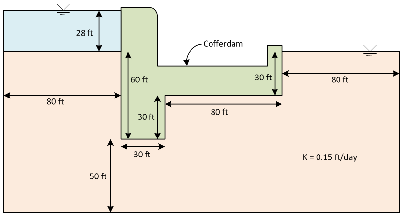
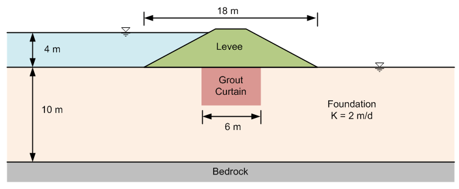

# Homework - Finite Difference Model of Levee & Grout Curtain

For this assignment, we will be using the findiff-2 spreadsheet to model flow beneath a cofferdam and a levee with a grout curtain. 

Excel starter file: [findiff-2.xlsm](findiff-2.xlsm)

**a) Cofferdam Problem**

Find a solution for flow beneath the copper dam shown below using the findiff-2 spreadsheet. Use a **10** ft x **10** ft grid cell spacing. Assume that the cofferdam is **260** ft long.

**b) Grout Curtain Design**

The objective of this exercise is to analyze the levee shown in the following figure. The levee is **300** m long in the transverse direction. The levee material is much less permeable than the foundation material so we will only model flow in the foundation. The depth of the grout curtain is not shown because we are going to analyze the grout curtain at various depths.

Build a finite difference model of the flow in the foundation using using the findiff-2 spreadsheet. Use a grid with **2** m spacing as shown below:

Use the spreadsheet to analyze the maximum hydraulic gradient and flow rate (total) under various grout curtain depths. Assume that the grout curtain is impemeable. Make a table showing the max gradient and total flow rate vs. depth of grout curtain where the depth varies in increments of 0, 2, 4, 6, and 8 m. Write a paragraph summarizing your observations from the exercise.

Put your table and summary in a word document. Save a copy of your spreadsheet with the 4 m deep grout curtain case.

## Submission

Zip up all three documents (one spreadsheet from part (a) and a spreadsheet and a word document from part (b)) into a single zip archive. Upload your zip archive via Learning Suite after we grade it together in class.

## Grading Rubric

Self-grade your assignment using the following rubric. Enter your points in the "Submission notes" section for the assignment on Learning Suite when you upload your file. You can use fractional points if you like (e.g. 2.5).

| Criteria                                    | Points |
|---------------------------------------------|:------:|
| Completed on time and all or mostly correct |   3    |
| Completed more than half of assignment      |   2    |
| Made an effort                              |   1    |
| Did nothing                                 |   0    |