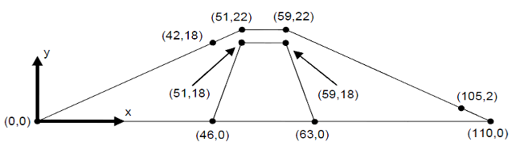
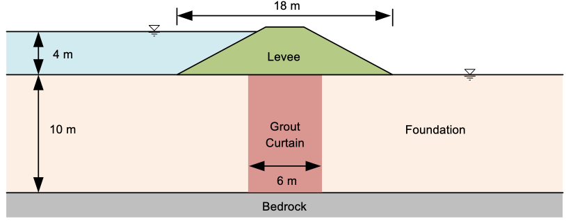
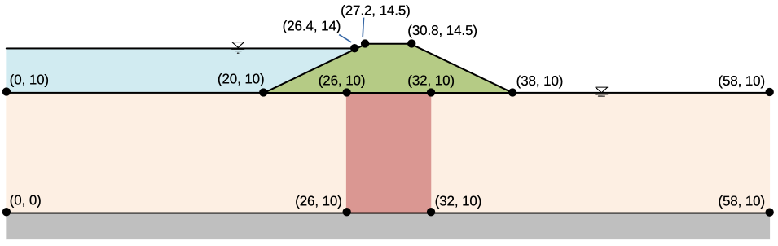

# Exercise - Unconfined Seepage Problems, Part 1

For this exercise, we will perform a pair of seepage analyses using XSLOPE for sites with unconfined (partially-saturated) conditions. For both cases, we will first prepare the problem inputs in an XSLOPE Excel input file starting with the standard template:

[input_template.xlsx](https://xslope.readthedocs.io/en/latest/inputs/input_template.xlsx)

After preparing each input file, launch the following Google Colab notebook to upload the Excel input file and 
perform the seepage analysis:

###1. Earth Dam with Core

The problem corresponds to the following cross section:

We will first prepare the problem inputs in an XSLOPE Excel input file. Start with the standard template:

[input_template.xlsx](https://xslope.readthedocs.io/en/latest/inputs/input_template.xlsx)

Use the Excel file to specify the 
material properties, define the 
geometry using a profile line, and assign 
boundary 
conditions. We will define a local coordinate system with the origin (x=0, y=0) at the toe of the dam on the left side of the figure. This results in the following set of points:

Solution: [xslope_earth_dam1.xlsx](https://xslope.readthedocs.io/en/latest/seep/files/xslope_earth_dam1.xlsx)

### 2. Levee with Grouted Foundation

For this problem we will revisit the levee problem but this time we will assume that the levee is permeable and will simulate flow both in the levee and in the grouted foundation. 

Assume that the following values for hydraulic conductivity:

|  Soil Layer   | K1 [m/day] | K2 [m/day] | $\alpha$   | kr0    | h0 |
|:-------------:|:----------:|:----------:|:----------:|:----------:|:----------:|
|     Levee     |    0.5     |    0.2     |    0       |   0.001 | -1 |
| Grout Curtain |    0.2     |    0.2     |    0       |   0.001 | -1 |
|  Foundation   |     2      |     1      |    0       |   0.001 | -1 |

Use the following coordinates to define the profile lines and boundary conditions:

Solution: [xslope_levee_full.xlsx](https://xslope.readthedocs.io/en/latest/seep/files/xslope_levee_full.xlsx)

