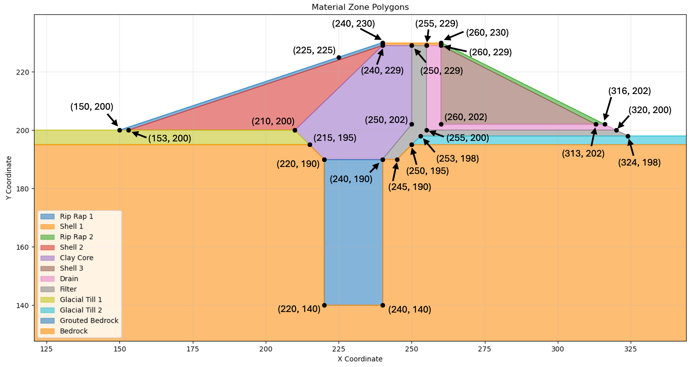
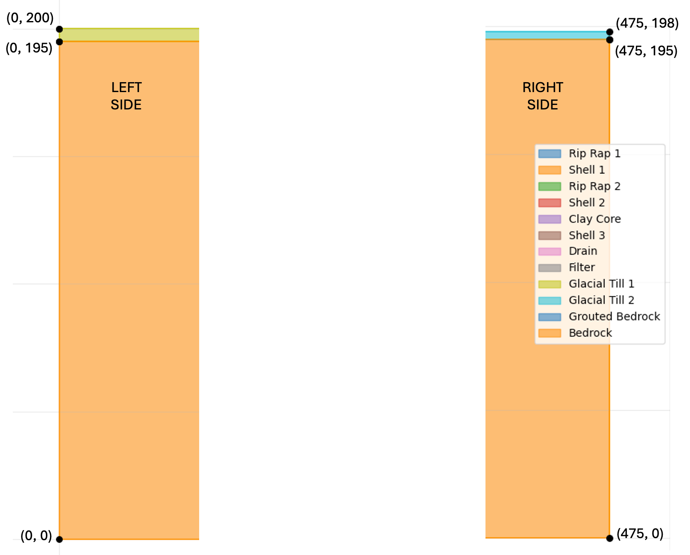

# Homework - Finite Element Seepage Analysis, Unconfined Conditions

For this exercise, you will build a finite element seepage model of the **Lost Lake** dam. It includes a grout curtain, core, 
shell, riprap, filter, and a drain as shown below. 

{width="1400"}

The water is impounded on the left side of the cross section at **H = 225 ft**. Water seeping out of the right side drains freely.

The material properties are as follows:

| Material        | kx [ft/yr] | Ky [ft/yr] | 
|-----------------|------------|-----------|
| Core            | 0.1        | 0.1       |
| Glacial Till    | 4000       | 2000      |
| Bedrock         | 2000       | 1000      |
| Rip Rap         | 100,000    | 100,000   |
| Shell           | 250        | 50        |
| Grouted Bedrock | 250        | 250        |
| Filter   | 1000       | 1000      |
| Drain    | 10,000     | 10,000    |

For each material, use:

>>$\alpha = 0.0$ $k_{r0} = 0.0001$ $h_0 = -1$

Start with the base XSLOPE template and modify it to fit the cross section above.

[input_template.xlsx](https://xslope.readthedocs.io/en/latest/inputs/input_template.xlsx)

Use elements that are sufficiently small to capture the details in the thin zones. Select appropriate boundary conditions for the model.

You will need to create your profile lines carefully to ensure that the model is well-posed. You will need a total 
of 12 profile lines and 12 corresponding materials. The coordinates of the points making up the center part of the 
cross 
section are shown below.

The coordinates of the left and right sides of the cross section are shown below:

Remember that your profiles lines should be listed in order from top to bottom and the points on each line should be listed in order from left to right.

Once the input file is complete, upload the file and solve the problem using XSLOPE using the seepage colab notebook:

Create a PNG of the solution with 25 head contours and use base material = bedrock (12). 

## Submission

Zip up your Excel file and a PNG of the solution plot and upload your zip archive via Learning Suite.

!!! Note
    You are allowed to work in pairs on this assignment if you wish. Just copy and upload the assignment when you are done and be sure to make a note who you worked with.

## Grading Rubric

| Criteria                                                                              | Points |
|---------------------------------------------------------------------------------------|:------:|
| XSLOPE Excel template modified correctly for Lost Lake dam geometry                  |   4    |
| 12 profile lines created in correct order (top to bottom)                            |   4    |
| Points on each profile line listed in correct order (left to right)                  |   2    |
| All 12 materials defined with correct hydraulic conductivity values (kx, ky)         |   5    |
| Material parameters (α, kr0, h0) set correctly for all materials                     |   2    |
| Boundary conditions appropriately selected (H=225 ft left, free drainage right)      |   3    |
| Element mesh sufficiently refined to capture details in thin zones                   |   3    |
| Model solves successfully without errors                                              |   2    |
| PNG output shows 25 head contours with base material = bedrock (12)                  |   3    |
| Proper file submission (zipped Excel file and PNG solution)                          |   2    |
| **Total**                                                                             | **30** |