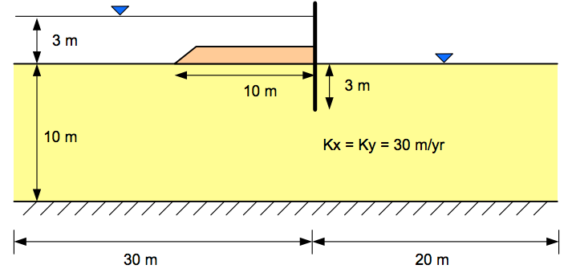

# Exercise - SEEP2 Confined Problem Tutorial

For this exercise, we will complete the GMS/SEEP2D tutorial for confined (fully-saturated) conditions. The problem corresponds to the clay-blanket sheetpile case:

We will first build a conceptual model of the problem domain, assign boundary conditions, create a mesh, and then run SEEP2D to solve the problem and generate a flow net.

To complete the tutorial, do the following:

1. Go to the [tutorial section of the GMS Learning Center](https://www.aquaveo.com/software/gms-learning-tutorials){:target="_blank"} 
   on the Aquaveo website.
2. Click on the **Additional** tab.
3. Download the PDF file associated with the **SEEP2D|Sheet Pile** problem.
4. Follow the instructions in the PDF tutorial document.

As you work through the exercise, you may with to use the following spreadsheet file with the coordinates of the key points on the sheetpile cross section:

Excel file: [sheetpiletutpoints.xlsx](sheetpiletutpoints.xlsx)

You can cut and paste these points in step 3.2 to save you some time.

GMS solution file: [s2con.zip](s2con.zip)