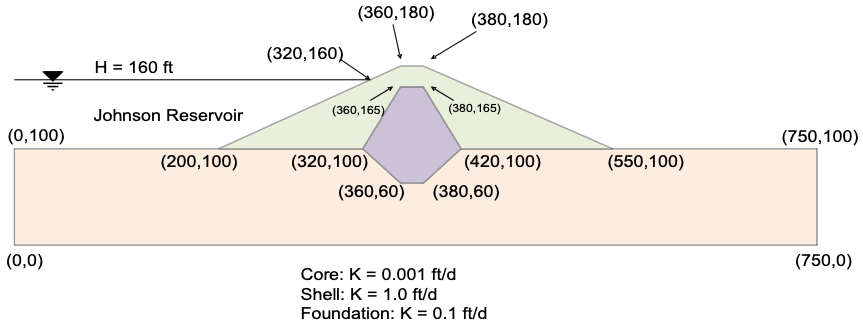
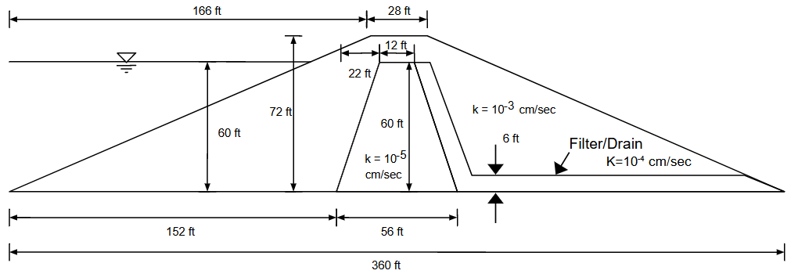

# Exercise - Seep2D Unconfined Problems

In this exercise, we will solve two different unconfined seepage problems using SEEP2D. The first problem corresponds to a simple earth dam with a low-permeability core and the second problem corresponds to a dam with a core, filter, and drain.

## Problem 1 - Johnson Reservoir

The Johnson Reservoir problem corresponds to the following cross section:

The coordinates of the key points on the cross section are provided in the following Excel file:

Excel file: [johnson_res.xlsx](johnson_res.xlsx)

Use the GMS interface to build a conceptual model of the problem domain, assign boundary conditions, create a mesh, and then run SEEP2D to solve the problem and generate a flow net.

## Problem 2 - Earth Dam with Core, Filter, and Drain

The Earth Dam with Core, Filter, and Drain problem corresponds to the following cross section:

In this case, we will go through the process of deriving the geometry (point coordinates) of the cross section from 
the image. Use the following Excel file to enter the coordinates of the key points on the cross section:

Excel starter file: [damwithfilterdrain.xlsx](damwithfilterdrain.xlsx)

Excel solution file: [damwithfilterdrain_KEY.xlsx](damwithfilterdrain_KEY.xlsx)

Once you have the coordinates, use the GMS interface to build a conceptual model of the problem domain, assign boundary conditions, create a mesh, and then run SEEP2D to solve the problem and generate a flow net.
