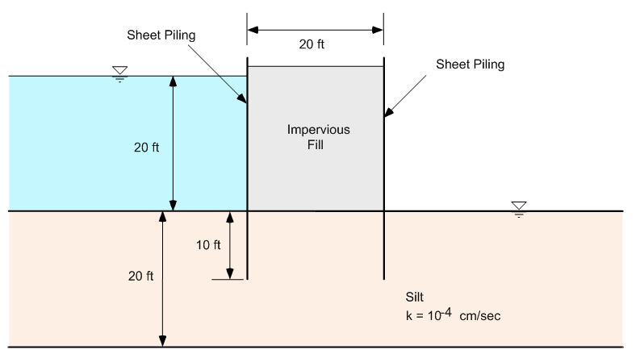
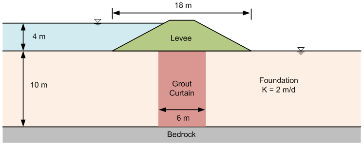

# Homework - SEEP2D Finite Element Model, Confined Conditions

(1) Redo the double sheetpile problem using GMS/SEEP2D:

Extend your mesh 40 ft both upstream and downstream from the sheetpiles (solve the entire problem, not just one half).

(2) Redo the grout curtain problem we solved in the previous assignment. As before, extend your problem domain 35 m beyond the toe of the levee in both directions. Once again, assume that the levee is relatively impermeable. But this time assume that the grout curtain extends all the way to bedrock and that the grout curtain is permeable but has a lower K than the foundation.

Set up the problem using GMS/SEEP2D and analyzie the flow rate (total) assuming various K values for the grout curtain. Make a table showing the total flow rate vs. k for the grout curtain where the k values varies as follows:

k = 2 m/d (same as no grout curtain) 
k = 1 m/d 
k = .5 m/d 
k = .2 m/d 
k = .1 m/d 
k = .01 m/d 
k = .001 m/d 

For each k value, show two flowrates: one for a unit width and one for the total levee section (once again, assume that the levee is **300** m long in the transverse direction). To find the total flowrate, to into the SEEP2D Display Options dialog and turn on the Total flowrate toggle. It will then be displayed at the top of the main window. Or you can find it in the SEEP2D output file. Write a paragraph summarizing your observations from the exercise.

## Submission

For part two, submit a copy of the k=0.2 m/d version of your GMS project. Zip up the GMS projects for parts one and two along with your word document for part two and upload the zip archive via Learning Suite.

!!! Note
    You are allowed to work in pairs on this assignment if you wish. Just copy and upload the assignment when you are done and be sure to make a note who you worked with.