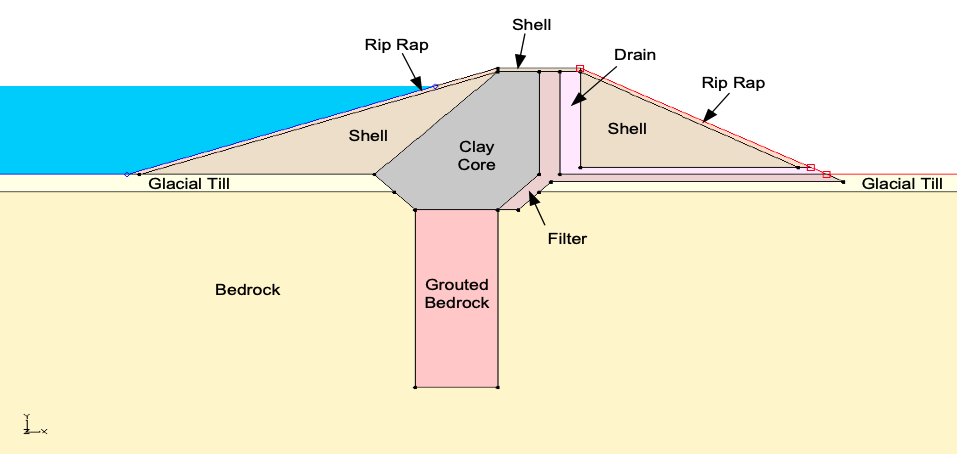
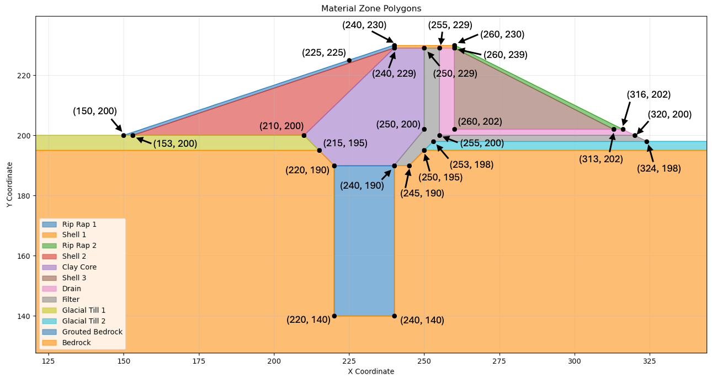
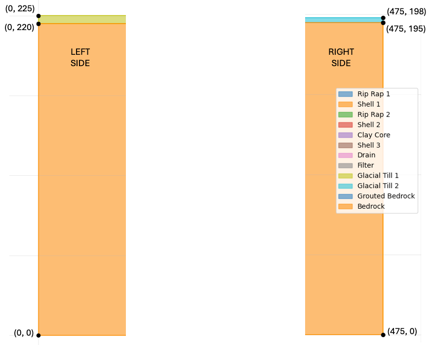

# Homework - SEEP2D Finite Element Model, Unconfined Conditions

For this exercise, you will build a SEEP2D finite element model of the **Lost Lake** dam. It includes a grout curtain, core, 
shell, riprap, filter, and a drain as shown below. 

{width="1400"}

The water is impounded on the left side of the cross section at **H = 225 ft**. Water seeping out of the right side drains freely.

The material properties are as follows:

| Material        | kx [ft/yr] | Ky [ft/yr] | 
|-----------------|------------|-----------|
| Core            | 0.1        | 0.1       |
| Glacial Till    | 4000       | 2000      |
| Bedrock         | 2000       | 1000      |
| Rip Rap         | 100,000    | 100,000   |
| Shell           | 250        | 50        |
| Grouted Bedrock | 250        | 250        |
| Filter   | 1000       | 1000      |
| Drain    | 10,000     | 10,000    |

For each material, use:

>>$\alpha = 0.0$ $k_{r0} = 0.0001$ $h_0 = -1$

Build a finite element model of the solution using XSLOPE using the seepage colab notebook:

>>

Start with the base XSLOPE template and modify it to fit the cross section above.

>>[XSLOPE Input Template](https://xslope.readthedocs.io/en/latest/inputs/slope/input_template_MASTER7.xlsx)

Use elements that are sufficiently small to capture the details in the thin zones. Select appropriate boundary conditions for the model.

You will need to create your profile lines carefully to ensure that the model is well-posed. You will need a total 
of 12 profile lines and 12 corresponding materials. The coordinates of the points making up the center part of the 
cross 
section are shown below.

The coordinates of the left and right sides of the cross section are shown below:

Remember that your profiles lines should be listed in order from top to bottom and the points on each line should be listed in order from left to right.

Create a PNG of the solution with 25 head contours and use base material = bedrock (12). 

## Submission

Zip up your Excel file and a PNG of the solution PNG file and upload your zip archive via Learning Suite.

!!! Note
    You are allowed to work in pairs on this assignment if you wish. Just copy and upload the assignment when you are done and be sure to make a note who you worked with.

## Grading Rubric

Self-grade your assignment using the following rubric. Enter your points in the "Submission notes" section for the assignment on Learning Suite when you upload your file. You can use fractional points if you like (e.g. 2.5).

| Criteria                                    | Points |
|---------------------------------------------|:------:|
| Completed on time and all or mostly correct |   3    |
| Completed more than half of assignment      |   2    |
| Made an effort                              |   1    |
| Did nothing                                 |   0    |