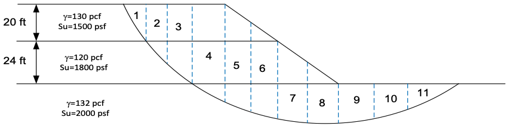
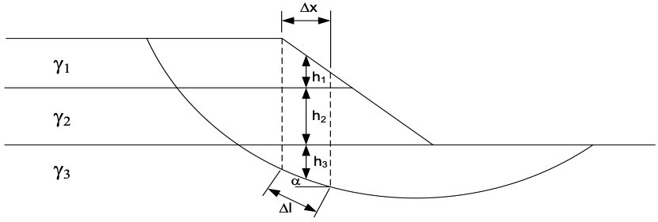

# Excercise - Swedish Method of Slices

The Swedish method of slices is a method used to calculate the factor of safety of a slope under undrained ($\phi=0$) conditions. The method is based on the assumption that the slope can be divided into a number of slices. Consider a slope with a failure surface as shown below:

We can analyze each slice as follows:

The weight of the slice ($W$) can be calculated by summing the height of each material in the slice multiplied by 
the width of the slice and the unit weight of the material ($\gamma_i h_i \Delta x$). 
The length along the slice can be computed as $\Delta l = \Delta x / cos \alpha$. The overall factor of safety for the slope is then 
calculated as:

$$
F = \frac{\sum{c\Delta l}}{\sum{W sin\alpha}}
$$

where:

>>$c$ = the undrained cohesion of the soil 
$\Delta l$ = the length of the slice along the failure surface 
$W$ = the weight of the slice 
$\alpha$ = the angle of the failure surface with the horizontal

Use the following spreadsheet to calculate the factor of safety for the slope. The slice widths ($\Delta x$), heights ($h_i$), slope angles ($\alpha$), unit weights ($\gamma$), and cohesions ($c$) are given in the spreadsheet. Fill in the remaining values and calculate the factor of safety.

Excel starter file: [swedish.xlsx](swedish.xlsx)

Excel solution file: [swedish_KEY.xlsx](swedish_KEY.xlsx)

