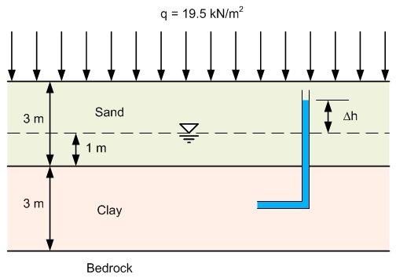

# Homework - Shear Strength

Solve the following problems. Put your solution in a Word, or Excel document. Assume values for any unspecified parameters ($G_s$, etc.). Show all work.

1. A surchage was placed over a deposit of soil as shown below. How high would the water rise in the piezometer (Δh) as a result of the surcharge? Assume the clay was full saturated prior to placement of the surcharge.

2. A normally-consolidated clay was subjected to a consolidated-undrained (CU) test. At failure, $σ_3$ = 100 $kN/m^2$, $σ_1$ = 205 $kN/m^2$, and $u_d$ (pore pressure at failure) = 50 $kN/m^2$. Determine $\phi_{cu}$ and $\phi'$.  

3. A sandy soil is subjected to a consolidated drained (CD) triaxial test. The confining stress during the consolidation stage is 100 kPa and the applied axial stress (the deviator stress) at failure is 200 kPa.

    a) Plot Mohr's circle for the conditions at the end of the consolidation stage and at the end of the shearing stage (at failure).
    
    b) Determine the friction angle ($\phi$) assuming that c=0.
    
    c) Determine the orientation of the failure plane.
    
    d) Determine the shear stress on the failure plane at failure.
    
    e) Determine the maximum shear stress in the sample at failure.
    
    f) Determine the orientation of the maximum shear stress at failure.

## Submission

Upload your document to the Learning Suite. 

## Grading Rubric

Self-grade your assignment using the following rubric. Enter your points in the comment section for the assignment on Learning Suite.

| Criteria                                    | Points |
|---------------------------------------------|:------:|
| Completed on time and all or mostly correct |   3    |
| Completed more than half of assignment      |   2    |
| Made an effort                              |   1    |
| Did nothing                                 |   0    |