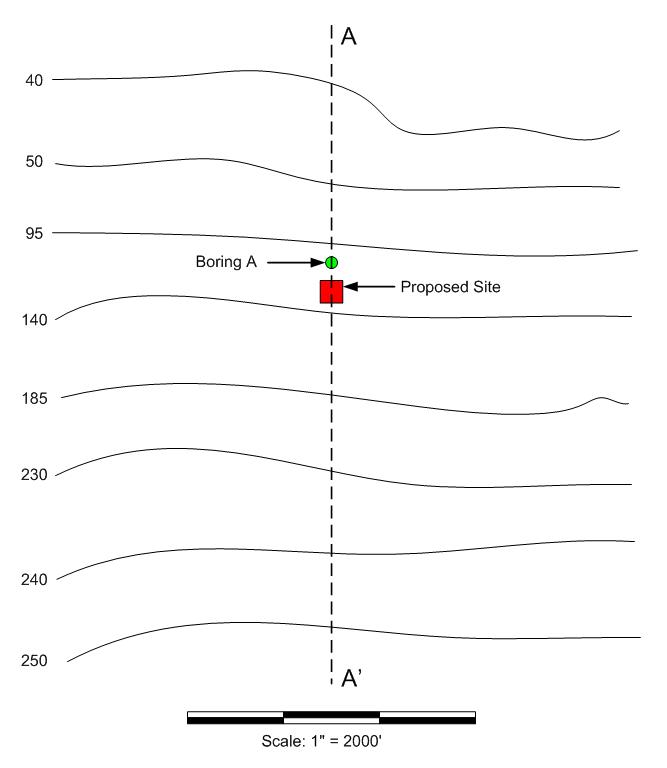
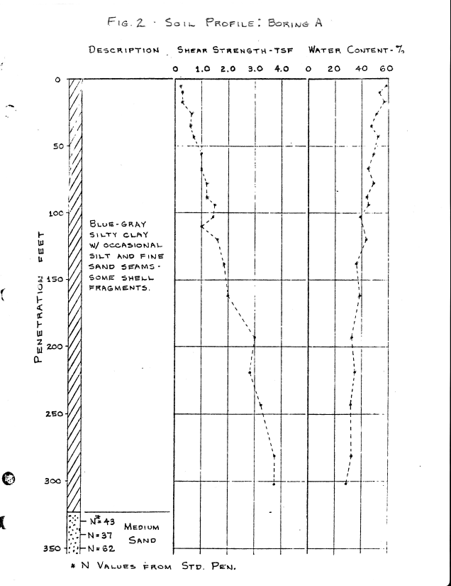

# Homework - Infinite Slope Analysis

The proposed site for an offshore structure is located in a region of gradually varying bottom slope off the California coast.  Due to the seismicity of this region the owner has asked for your preliminary evaluation of the stability of the slope during an earthquake.

The significant water depth contours (in fathoms) are shown on the plan view of the site in the following map:

 
Previous exploration in 
the vicinity of the site indicates that the soil profile is relatively uniform over a large area, and for this and 
economic reasons only one soil boring was taken for the current investigation. The location of this boring (Boring A)
is shown in the map above and the boring log details are as follows:

The shear strength values shown on the boring log were 
measured in unconsolidated undrained triaxial compression tests.

Recall that for a submerged slope under undrained conditions the infinite slope factor of safety can be found using the following equation:

>>$FS = \dfrac{c}{\gamma'z} \dfrac{2}{sin(2\beta)}$

where:

>>$c$ = undrained cohesion of the soil 
$\gamma'$ = effective unit weight of the soil 
$z$ = depth of the slope 
$\beta$ = angle of the slope with the horizontal

The effective unit weight of the soil can be calculated as:

>>$\gamma' = \gamma_{sat} - \gamma_w$

where:

>>$G_s$ = specific gravity of the soil 
$w$ = moisture content of the soil

As a first approximation for the stability during an earthquake compute the static factor of safety of the slope 
using an infinite slope analysis and a cross-section along the line A-A'.  For many clay slopes a factor of safety 
of 2.0 or greater with respect to static stability is adequate to ensure that stability will be maintained during an 
earthquake. Using the data above, calculate the factor of safety of the slope.

Excel starter file: [infslope.xlsx](infslope.xlsx)

**TIPS:**

1) Note the slope details at the bottom of the sheet. Use the cells in part one to 
   estimate the 
   average slope 
   angle of the middle steeper section.

2) Use the table in part 2 to calculate the FS at each depth. Be sure to use the correct FS equation.

3) At each depth, use the undrained strength at that depth, but the average unit wt above that depth.

## Submission

Submit the completed Excel file to Learning Suite after we grade it together in class.

## Grading Rubric

Self-grade your assignment using the following rubric. Enter your points in the "Submission notes" section for the assignment on Learning Suite when you upload your file. You can use fractional points if you like (e.g. 2.5).

| Criteria                                    | Points |
|---------------------------------------------|:------:|
| Completed on time and all or mostly correct |   3    |
| Completed more than half of assignment      |   2    |
| Made an effort                              |   1    |
| Did nothing                                 |   0    |