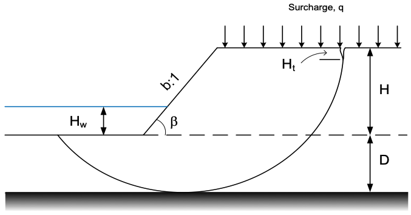

# Exercise - Slope Stability Charts

The slope stability chart solutions in Appendix A of your textbook (Shear Strength and Slope Stability by Duncan 
and Wright) can be used to find a quick solution to a variety of slope stability problems for cases involving simple 
slopes with a single soil layer. In this exercise, we will use the slope stability charts for undrained ($\phi = 0$) 
conditions. The variables used in the charts are:

The equations used to calculate the factor of safety are:

$$
F = N_o\frac{c}{P_d}
$$

$$
P_d = \frac{\gamma H + q - \gamma_w H_w}{\mu_q \mu_w \mu_t}
$$

Where:

>>$F$ = Factor of safety 
$c$ = Undrained cohesion 
$\gamma$ = Unit weight of soil 
$H$ = Height of slope 
$D$ = Depth below slope to bedrock 
$q$ = Surcharge load 
$\gamma_w$ = Unit weight of water 
$H_w$ = Height of water on slope 

The following factors are found from the charts:

>>$N_o$ = Stability number 
$\mu_q$ = Surcharge adjustment factor 
$\mu_w$ = Submergence adjustment factor 
$\mu_t$ = Tension crack adjustment factor 

The following Excel file can be used to calculate the factor of safety for using inputs from the stability charts. 
Use the Excel file to calculate the factor of safety for a slope with the properties given below:

| Property  | Value | Units |
|-----------|-------|-------|
| $c (S_u)$ | 500   | psf |
| $\phi$    | 0     | degrees |
| $H$       | 20    | ft |
| $D$       | 0     | ft |
| $H_t$     | 0     | ft |
| $H_w$     | 0     | ft |
| $q$       | 0     | psf |
| $\gamma$  | 120   | pcf |

You will need to enter the property values, the factors from the charts, and the formulas for $F$ and $P_d$. After 
finding a 
solution, experiment 
with the other 
variables to see how they 
affect 
the factor of safety.

Excel starter file: [chart_solution.xlsx](chart_solution.xlsx)

Excel solution file: [chart_solution_KEY.xlsx](chart_solution_KEY.xlsx)

