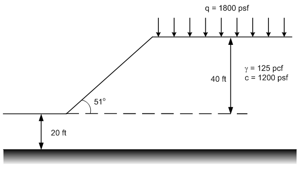

# Homework - Chart Solutions

Use the Excel solution we used for the class exercise ([link](chart_solution_KEY.xlsx)) and the stability charts for the phi=0 case in the Appendix of the textbook to solve the following problems:

(1) Submerged slope. Remember that $H_w$ should not be greater than H or you will overcompensate the pore pressures.

(2) Slope with surcharge.

(3) Slope with two materials.

(4) Design problem. Find the slope angle $(\beta)$ with a minimum factor of safety = 1.5.

## Submission

Save a copy of the Excel file with a solution for each problem. Zip the four solutions to a zip file and upload 
the zip file to Learning Suite.