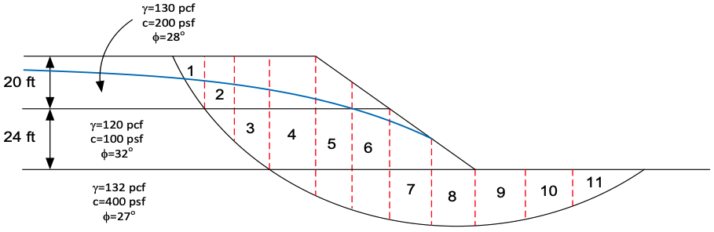
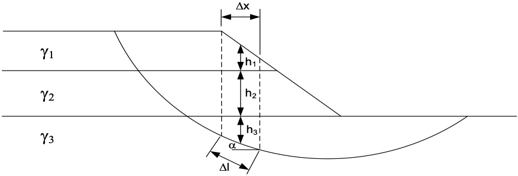

# Exercise - The Ordinary Method of Slices

In this exercise, you will apply the Ordinary Method of Slices (OMS) to analyze the stability of a slope. The Ordinary Method of Slices is a common approach to analyze the stability of slopes using the Limit Equilibrium Method and can be used for effective stress (drained) cases where $\phi \ne 0$. In this case, we will apply it to the following slope that is partially saturated with a piezometric line.

Once again, we will we analyze each individual slice using the following paramaters:

The factor of safety for the OMS method is calculated as follows:

$$
FS = \frac{\sum {\left[c'\Delta l + \left(W cos\alpha - u \Delta l cos^2\alpha\right)\tan\phi'\right]}}{\sum {W\sin\alpha}}
$$

Where:

>>$c'$ = the effective cohesion at the base of the slice 
$\phi'$ = the friction angle at the base of the slice 
$\Delta l$ = the length of the base of the slice 
$W$ = the weight of the slice 
$\alpha$ = the angle of the slope at the base of the slice 
$u$ = the pore water pressure at the base of the slice

To get the pore pressure (u) at the base of the slice, we can use the following equation:

$$
u = \gamma_w \cdot h_w
$$

Where:

>>$\gamma_w$ = the unit weight of water 
> $h_w$ = the height of the water above the base of the slice

Download the Excel file below and use it to calculate the factor of safety for the slope.

Excel starter file: [oms.xlsx](oms.xlsx)

Excel solution file: [oms_KEY.xlsx](oms_KEY.xlsx)

