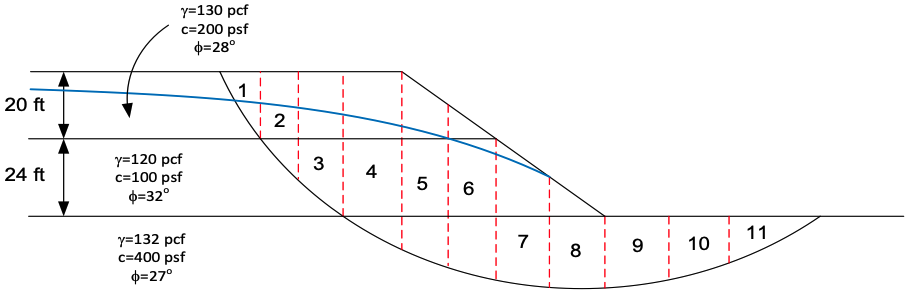
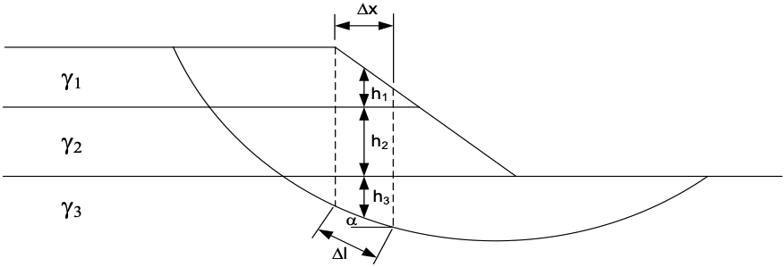

# Homework - Bishop's Simplified Procedure

For this assignment, you will use the Bishop's Simplified Procedure to analyze the stability of a slope using Excel. You will be solving the same slope we analyzed as a class exercise using the Ordinary Method of Slices (OMS). The slope is partially saturated with a piezometric line.

The slice details are as follows:

The factor of safety for the Bishop's Simplified Procedure is calculated as follows:

>>$F = \dfrac{\sum {\left[\dfrac{c'\Delta l + \left(W cos\alpha - u \Delta l cos^2\alpha\right)\tan\phi'}{cos\alpha + \left(sin\alpha\tan\phi'\right)/F}\right]}}{\sum {W\sin\alpha}}$

Where:

>>$c'$ = the effective cohesion at the base of the slice 
$\phi'$ = the friction angle at the base of the slice 
$\Delta l$ = the length of the base of the slice 
$W$ = the weight of the slice 
$\alpha$ = the angle of the slope at the base of the slice 
$u$ = the pore water pressure at the base of the slice = $\gamma_w \cdot h_w$ 
$\gamma_w$ = the unit weight of water 
$h_w$ = the height of the water above the base of the slice

Note that the factor of safety (F) is a function of the unknown factor of safety (F) itself. Therefore, the calculation must be done iteratively. You can start with an initial guess for F and then update it until the difference between the calculated F and the assumed F is less than a specified tolerance (e.g., 0.0001).

Download the Excel file below and use it to calculate the factor of safety for the slope.

Excel starter file: [bsp.xlsx](bsp.xlsx)

## Submission

Upload the completed Excel file to Learning Suite after we grade it together in class.

## Grading Rubric

Self-grade your assignment using the following rubric. Enter your points in the "Submission notes" section for the assignment on Learning Suite when you upload your file. You can use fractional points if you like (e.g. 2.5).

| Criteria                                    | Points |
|---------------------------------------------|:------:|
| Completed on time and all or mostly correct |   3    |
| Completed more than half of assignment      |   2    |
| Made an effort                              |   1    |
| Did nothing                                 |   0    |