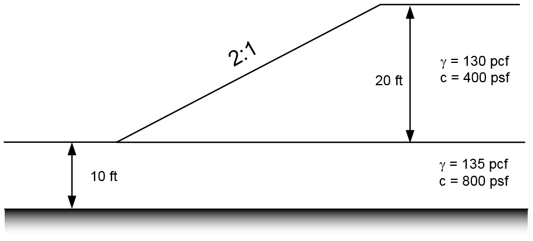

# Exercise - UTEXASED Problems, Part 1

In this exercise, we will solve three slope stability problems using the UTEXASED software.

## Problem 1 - Simple Embankement

Solve the following problem using UTEXASED:

**Variations:**

a) Distributed load on top of slope. q = 750 psf

b) Tension crack. Depth = 3 ft

c) Submerged by 10 ft depth of water (use distributed load)

## Problem 2 - Simple Slope with Foundation

Solve the following problem using UTEXASED:

## Problem 3 - Slope with Multiple Layers

Solve the following problem using UTEXASED. Be careful to find the location of the critical circle (global minimum FS).

**Variations:**

a) Change the cohesion of the lower material to see the effect on the location of the critical circle (slope circle vs. deep circle)