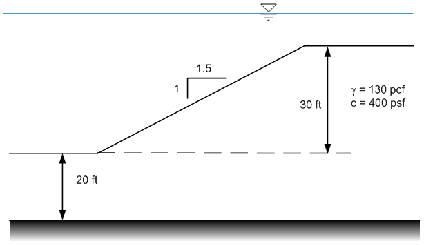
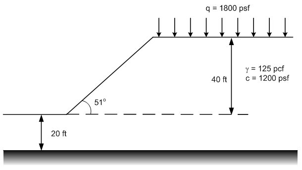

# Homework - XSLOPE LEM, Part 1

Solve the following problems using XSLOPE. Perform an automated search using Spencer's method.

(a) Submerged slope. 

Be sure to use total unit wt and model the external water using a distributed load.

(b) Slope with surcharge.

(c) Slope with two materials.

## Submission

Save a copy of the Excel template for each of the three problems and save a PNG of the solution with the minimum factor of safety. Zip up your files into a single zip archive. Upload your zip archive via Learning Suite.

## Grading Rubric

| Criteria                                                                              | Points |
|---------------------------------------------------------------------------------------|:------:|
| **Problem (a): Submerged Slope**                                                     |        |
| XSLOPE model set up correctly with proper geometry                                   |   2    |
| Total unit weight used (not buoyant unit weight)                                     |   2    |
| External water modeled using distributed load                                        |   2    |
| Automated search using Spencer's method executed correctly                           |   1    |
| Minimum factor of safety identified and reported with PNG                            |   1    |
| **Problem (b): Slope with Surcharge**                                                |        |
| XSLOPE model set up correctly with proper geometry                                   |   2    |
| Surcharge load correctly applied                                                     |   2    |
| Automated search using Spencer's method executed correctly                           |   1    |
| Minimum factor of safety identified and reported with PNG                            |   1    |
| **Problem (c): Slope with Two Materials**                                            |        |
| XSLOPE model set up correctly with proper geometry                                   |   2    |
| Two materials defined with correct properties and interface                          |   2    |
| Automated search using Spencer's method executed correctly                           |   1    |
| Minimum factor of safety identified and reported with PNG                            |   1    |
| **General**                                                                           |        |
| All three Excel templates and three PNG files properly submitted in zip archive      |   10   |
| **Total**                                                                             | **30** |