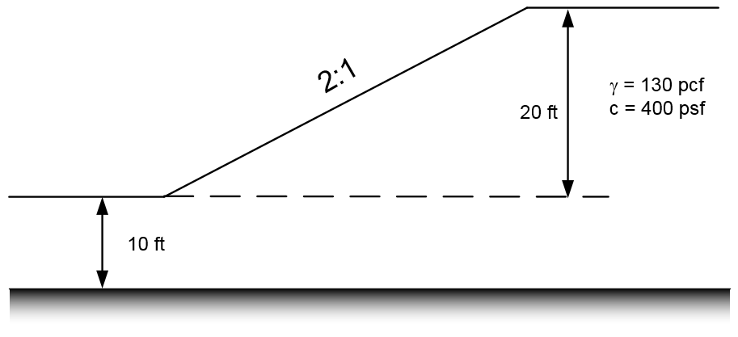

# Exercise - Stability Analysis with XSLOPE, Part 1

In this exercise, we will solve three slope stability problems using the XSLOPE python package. For each problem, start with the standard Excel input template:

[input_template.xlsx](https://xslope.readthedocs.io/en/latest/inputs/input_template.xlsx)

After preparing each set of inputs, launch the XSLOPE Google Colab notebook for stability analysis and upload your Excel input file and solve:

For each problem, explore the results using the variations suggested below.

## Problem 1 - Simple Embankement

Solve the following problem using XSLOPE:

**Variations:**

a) Distributed load on top of slope. q = 750 psf 
b) Tension crack. Depth = 3 ft 
c) Submerged by 10 ft depth of water (use distributed load)

## Problem 2 - Simple Slope with Foundation

Solve the following problem using XSLOPE:

## Problem 3 - Slope with Multiple Layers

Solve the following problem using XSLOPE. Be careful to find the location of the critical circle (global minimum FS).

**Variations:**

a) Change the cohesion of the lower material to see the effect on the location of the critical circle (slope circle vs. deep circle)