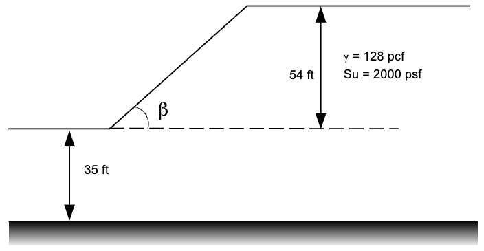

# Homework - XSLOPE LEM, Part 2

In this homework, we will be using the XSLOPE LEM method to solve for the critical factor of safety against slope failure for two problems. In each case, start with the standard Excel input template:

[input_template.xlsx](https://xslope.readthedocs.io/en/latest/inputs/input_template.xlsx)

Then solve using the XSLOPE Google Colab notebook for stability analysis:

## Problem 1: Earth Dam Problem from Textbook

Use XSLOPE to solve for the critical factor of safety against slope failure for the following problem based on a circular failure surface (compare to page 121 in your textbook):

You will need to calculate the proper coordinates for your profile lines. Extend the problem 150 ft to the left and the right of the upstream and downstream toes of the dam. Use the given elevations for the y coordinates and let x=0 at the upstream toe of the dam. Do your coordinate calculations in the Excel input spreadsheet.

The material properties are as follows:

|  Mat   | γ (pcf) | c' (psf) | $\phi$' (degrees) |
|:------:|:-------:|:--------:|:-----------------:|
| Shell  |   125   |    0     |        34         |
|  Core  |   122   |   100    |        26         |
|  Clay  |   123   |    0     |        24         |
|  Sand  |   127   |    0     |        32         |

The coordinates of the piezometric line are as follows:

| x (ft) | y (ft) |
|:------:|:------:|
|  -150  |  302   |
| 277.5  |  302   |
|  315   |  275   |
| 343.5  |  240   |
|  590   |  227   |
|  740   |  227   |

Be sure to include external loads to represent the water on the upstream side. Calculate your distributed loads in the same spreadsheet you used for the coordinate calculations.

Use a circular failure surface. Perform two sets of calculations: one for the upstream side and one for the downstream side. The side that is analyzed depends on the locations of your starting circles. Save a copy of the solution for each side.

## Problem 2: Slope Design Problem

For this problem, we will use XSLOPE to design a slope using the Colab notebook and methodology described here:

[https://xslope.org/en/latest/lem/design/](https://xslope.org/en/latest/lem/design/)

We will be using the following design problem:

Use XSLOPE to find the slope angle ($\beta$) that has a critical factor of safety = 1.4 (within a tolerance of 0.01).
Setup your problem the coordinate origin (0,0) at the toe of the slope. Extend the problem 120 ft to the left of the 
toe and 240 ft to the right of the toe.

Let your beta angle vary from 25 to 35 degrees.

Save a copy of the final solution and the FS vs beta design chart.

## Submission

For part 1, save a copy of your Excel input file (both sides) and a PNG of the two solution plots. For part 2, save 
a copy of your Excel input file and a copy of the final solution and your design chart. Zip up your files 
into a single zip archive. Upload your zip archive via Learning Suite.

## Grading Rubric

### Problem 1: Earth Dam (20 pts)

| Criteria                                                                              | Points |
|---------------------------------------------------------------------------------------|:------:|
| Profile line coordinates calculated correctly in spreadsheet                         |   3    |
| Problem domain extends 150 ft left and right of upstream/downstream toes             |   1    |
| Coordinate system set up correctly (x=0 at upstream toe, given elevations for y)     |   1    |
| All four materials defined with correct properties (c', φ', γ)                       |   3    |
| Piezometric line coordinates entered correctly                                        |   2    |
| Distributed loads calculated correctly in spreadsheet for upstream water             |   3    |
| External loads applied correctly to represent water on upstream side                 |   2    |
| Upstream side analysis performed and minimum FOS identified                          |   2    |
| Downstream side analysis performed and minimum FOS identified                        |   2    |
| Excel input files and PNG solution plots for both sides submitted                    |   1    |

### Problem 2: Slope Design (10 pts)

| Criteria                                                                              | Points |
|---------------------------------------------------------------------------------------|:------:|
| Profile line coordinates set up correctly with origin at toe of slope                |   2    |
| Problem domain extends 120 ft left and 240 ft right of the toe                       |   1    |
| Material properties defined correctly                                                 |   1    |
| Beta range set correctly (25 to 35 degrees)                                           |   1    |
| Target FOS of 1.4 achieved within tolerance of 0.01                                   |   2    |
| FS vs beta design chart saved                                                         |   1    |
| Excel input file, final solution, and design chart submitted                         |   2    |

### Total: 30 pts