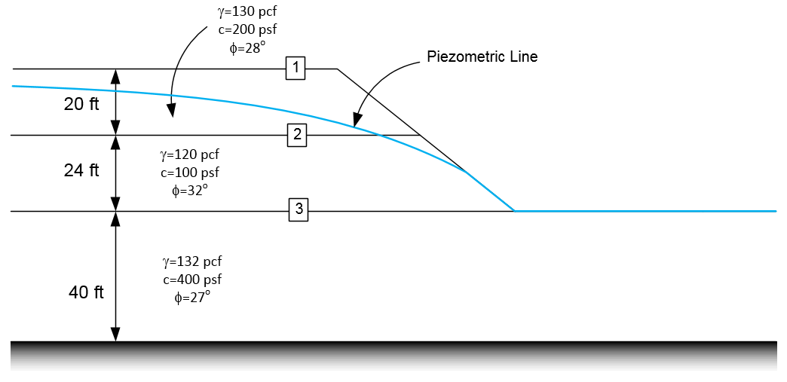
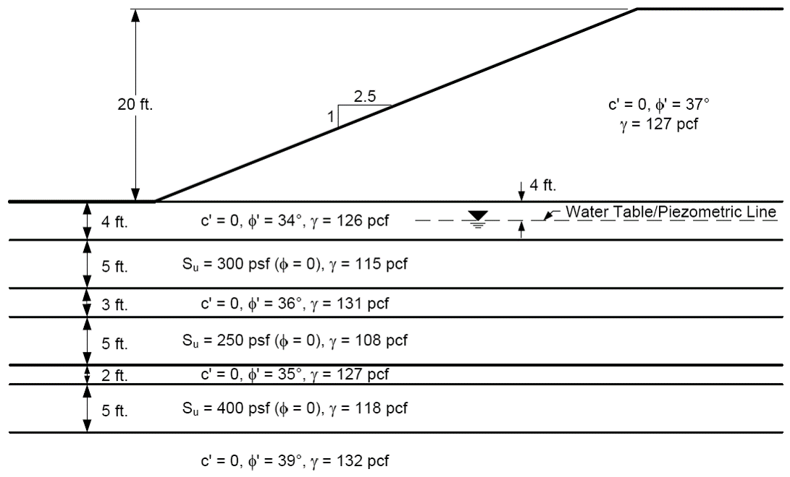
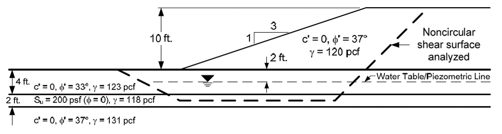

# Exercise - UTEXASED Problems, Part 2

In this exercise, we will solve three additional slope stability problems using the UTEXASED software.

## Problem 1 - Method of Slices Problem

This is the same problem we solved earlier using an Excel spreadsheet. Solve using UTEXASED.

Use the following spreadsheet to get the coordinates of the piezometric line:

[method-of-slices-input.xlsx](method-of-slices-input.xlsx)

## Problem 2 - Multi-Layer Foundation Problem

Solve the following problem using UTEXASED. Use the interactive search option.

Use the following UTEXASED input file as a starting point:

[multi-layer foundation.input-utexased](multi-layer%20foundation.input-utexased)

## Problem 3 - Non-Circular Failure Surface Problem

Solve the following problem using UTEXASED. Use the non-circular surface option.

**Variations:**

a) Circular failure surface 
b) Individual non-circular surface 
c) Automatic search non-circular surface