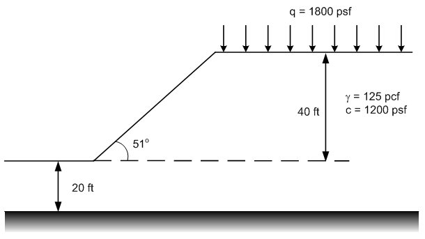
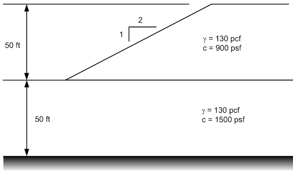

# Homework - UTEXASED, Part 1

The following problems were solved in the previous assignment using the stability charts. Redo the problems but use UTEXASED this time.

(a) Submerged slope. 

Be sure to use total unit wt and model the external water using a distributed load.

(b) Slope with surcharge.

(c) Slope with two materials.

## Submission

Use the File|Save As command in UTEXASED to save a copy of each of your input files. Zip up your files into a single zip archive. Upload your zip archive via Learning Suite.

## Grading Rubric

Self-grade your assignment using the following rubric. Enter your points in the comment section for the assignment on Learning Suite.

| Criteria                                    | Points |
|---------------------------------------------|:------:|
| Completed on time and all or mostly correct |   3    |
| Completed more than half of assignment      |   2    |
| Made an effort                              |   1    |
| Did nothing                                 |   0    |