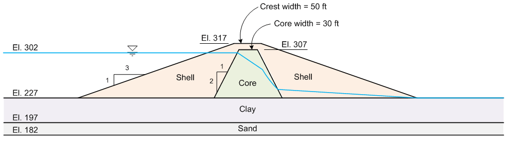

# Homework - UTEXASED, Part 2

Use UTEXASED to solve for the critical factor of safety against slope failure for the following problem based on a circular failure surface (compare to page 121 in your textbook):

You will need to calculate the proper coordinates for your profile lines. Extend the problem 150 ft to the left and the right of the upstream and downstream toes of the dam. Use the given elevations for the y coordinates and let x=0 at the upstream toe of the dam. Please do your coordinate calculations in a spreadsheet so that I can easily check your calculations.

The material properties are as follows:

|  Mat   | c' (psf) | φ' (degrees) | γ (pcf) |
|:------:|:--------:|:------------:|:-------:|
| Shell  |    0     |      34      |   125   |
|  Core  |   100    |      26      |   122   |
|  Clay  |    0     |      24      |   123   |
|  Sand  |    0     |      32      |   127   |

The coordinates of the piezometric line are as follows:

| x (ft) | y (ft) |
|:------:|:------:|
|  -150  |  302   |
| 277.5  |  302   |
|  315   |  275   |
| 343.5  |  240   |
|  590   |  227   |
|  740   |  227   |

Be sure to include external loads to represent the water on the upstream side.

Use a circular failure surface. Perform two sets of calculations: one for the upstream side and one for the downstream side. The side that is analyzed depends on the locations of your starting circles.

## Submission

Use the File|Save As command in UTEXASED to save a copy of each of your input files. Zip up your files (including your spreadsheet showing your coordinate and distributed load calculations) into a single zip archive. Upload your zip archive via Learning Suite after we grade it together in class.

## Grading Rubric

Self-grade your assignment using the following rubric. Enter your points in the "Submission notes" section for the assignment on Learning Suite when you upload your file. You can use fractional points if you like (e.g. 2.5).

| Criteria                                    | Points |
|---------------------------------------------|:------:|
| Completed on time and all or mostly correct |   3    |
| Completed more than half of assignment      |   2    |
| Made an effort                              |   1    |
| Did nothing                                 |   0    |