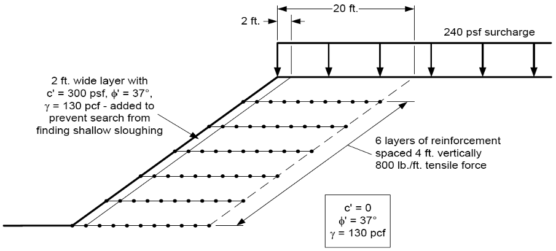

# Exercise - Reinforced Slopes

In this exercise, we will examine two cases of reinforced slopes. The first case is a slope with a series of geogrid layers and the second is an underwater slope with some concrete piers.

## Problem 1 - Geogrid Reinforcement

Consider the following reinforced slope:

(a) Set up the problem and solve for the factor of safety using UTEXASED without the reinforcement. Note the factor of 
safety.

(b) Solve again but include the impact of the geogrid layers. Compare the factor of safety and the location of the 
critical circle with and without the 
reinforcement. Assume the full tensile force in the geogrids develops over a length of 4 ft.

The following table provides the geometry of the profile lines, distributed loads, and the reinforcement lines:

Excel starter file: [geogrid_slope_input.xlsx](geogrid_slope_input.xlsx)

UTEXASED solution file: [geogrid.input-utexased](geogrid.input-utexased)

## Problem 2 - Underwater Slope with Piers

Consider the following underwater slope with concrete piers:

Solve the problem using UTEXASED. You will need to add the weight of the water as 
a distributed load. The pile caps above the top of the slope weigh 20000 lb/ft. Since UTEXASED does not support 
line loads, convert them to an equivalent 
distributed load and add them to the distibuted load from the water. For the clay soil, assume the following:

>>Unit weight of soil = 120 lb/ft^3 
Strength = linear increase with depth (c/p ratio) 
At y = 8, $S_u$ = 100 lb/ft^2 
$\Delta S_u/\Delta y$ = 10 lb/ft^2

The concrete piers inside the slope act as a form of reinforcement. Solve the problem in two steps as follows:

(a) Solve the problem with the pile cap only. Neglect the internal reinforcement provided by the piers.

(b) Solve the problem with the internal reinforcement provided by the piers.

Use the following Excel starter file to set up the problem. You will need to set up the distributed load table.

Excel starter file: [underwater_slope_input.xlsx](underwater_slope_input.xlsx)

Excel solution file: [underwater_slope_input_KEY.xlsx](underwater_slope_input_KEY.xlsx)

UTEXASED solution file - part (a): [underwater-1.input-utexased](underwater-1.input-utexased)

UTEXASED solution file - part (b): [underwater-2.input-utexased](underwater-2.input-utexased)