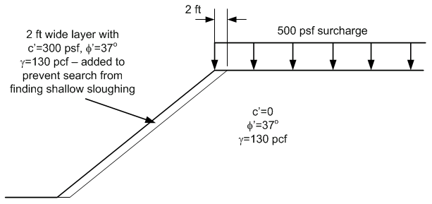

# Homework - Reinforced Slope Design

The following slope is similar to the geogrid problem we solved in class:

The objective of this assignment is to design a reinforced slope using geogrids that is both safe and economical. You 
will determine the number of geogrid layers, their elevations, and their lengths. Use UTEXASED to perform the slope stability analysis and to design the reinforcement.

The inputs to the slope (coordinates, etc.) have been prepared for you and can be downloaded in spreadsheet form by clicking on the following link:

[slope_design_input.xlsx](slope_design_input.xlsx)

Complete the assignment in two parts:

**(a) Slope analysis**

Solve the problem assuming the slope does not have any reinforcement. Compute the critical factor of safety using a circular failure surface.

**(b) Reinforcement design**

Design reinforcement for the slope using layers of geogrids. You can add as many layers as you need (up to the limit of 10) and you can put them at any combination of elevations. Design a length for the layers, but keep each layer the same length in order to simplify the problem. In summary, you will have three basic design parameters:

1. Number of layers
2. Elevations for the layers
3. Lateral length of the layers.

Note the formula in the spreadsheet for computing the total cost of the geogrid. The cost is based on a cost per unit length and is multiplied by the number of layers and the layer length. The length of the slope in the transverse direction is already factored into the unit cost. You should adust your design to satisfy the following constraints:

* Minimize the total cost
* FS must be >= 1.5

You should examine the formulas in the reinforcement tables. All you need to do is adjust the elevation of each geogrid and the coordinates will automatically be computed for you. We will assume that the tensile strength is developed linearly over a distance of four feet. You should also edit the **Geogrid Length** input value.

To ensure that the total cost is calculated correctly, make sure you keep the **# geogrid layers** value properly updated. If you need more than six geogrids, copy and paste to create more tables.

!!! Note
    You may work in pairs on this assignment.

## Submission

Use the **File|Save As** command in UTEXASED to save a copy of your input files for parts A and B. The version you submit for part B should correspond to your final design. Zip up your files (including the spreadsheet showing your final design configuration and total cost) into a single zip archive. Upload your zip archive via Learning Suite.

## Grading Rubric

Self-grade your assignment using the following rubric. Enter your points in the comment section for the assignment on Learning Suite.

| Criteria                                    | Points |
|---------------------------------------------|:------:|
| Completed on time and all or mostly correct |   3    |
| Completed more than half of assignment      |   2    |
| Made an effort                              |   1    |
| Did nothing                                 |   0    |