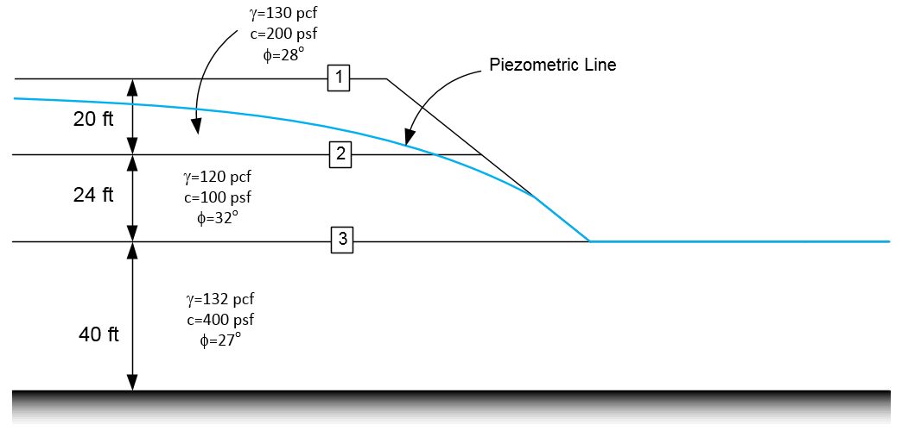
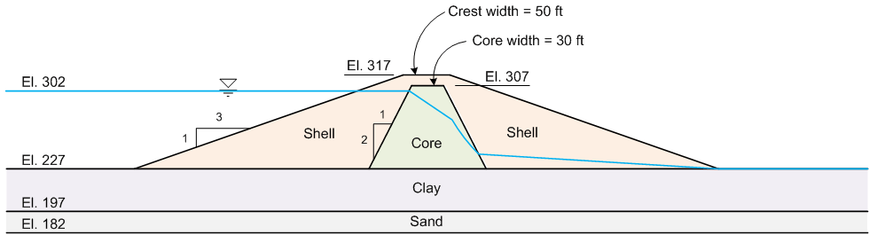

# Exercise - Seepage/Slope Stability Integration

In this exercise, we will combine seepage and slope stability analyses using XSLOPE. We will first run a seepage analysis to compute pore pressures and then use those pore pressures in a slope stability analysis. 

Use the XSLOPE Google Colab seepage notebook for the seepage analysis:

Use the XSLOPE Google Colab LEM notebook for the slope stability analysis:

## Problem 1 - Method of Slices Problem with Seepage

This is the same problem we solved earlier in the XSLOPE exercises.

Use the following Excel input file to get started:

[xslope_rface.xlsx](./files/xslope_rface.xlsx)

### Part a - Piezometric Line

First, solve the problem using a piezometric line to define the pore pressures. Set the pore pressure option for each material to `piezo`. Enter the following piezometric line coordinates on the **piezo** sheet:

|   x   |  y  |
|:-----:|:---:|
|   0   | 80  |
|  75   | 79  |
|  112  | 76  |
|  140  | 70  |
|  170  | 61  |
| 189.5 | 52  |
| 204.3 | 40  |
|  320  | 40  |

Use a single starting circle to find the factor of safety.

### Part b - Seepage Analysis

Now solve the same problem using a seepage analysis.

Use the following seepage properties for the three materials:

| Material | k1  | k2  | alpha | kr0    | h0 |
|:--------:|:---:|:---:|:-----:|:------:|:--:|
| Silt     | 0.5 | 0.5 | 0     | 0.0001 | -1 |
| Sand     | 1   | 1   | 0     | 0.0001 | -1 |
| Clay     | 0.01| 0.01| 0     | 0.0001 | -1 |

1. Change the pore pressure option for each material to `seep` on the **mat** sheet.
2. Enter the seepage properties for each material on the **mat** sheet using the values from the table above.
3. Remove the piezometric line coordinates from the **piezo** sheet.
4. Set up the seepage boundary conditions on the **seep bc** sheet using a specified head of H = 80 ft on the upstream boundary and an exit face on the downstream boundary.
5. Run the seepage analysis using the **seepage notebook** and download the zip archive.
6. Upload the zip archive to the **LEM notebook** and run the slope stability analysis. Use a single starting circle.
7. Compare the factor of safety to the piezometric line solution from Part a.

Solutions:

[xslope_rface_PIEZO_KEY.xlsx](../07_seep_slope/files/xslope_rface_PIEZO_KEY.xlsx) 
[xslope_rface_SEEP_KEY.xlsx](../07_seep_slope/files/xslope_rface_SEEP_KEY.xlsx) 
[xslope_rface_SEEP_KEY_results.zip](../07_seep_slope/files/xslope_rface_SEEP_KEY_results.zip)

## Problem 2 - Earth Dam Problem with Seepage

This is the same problem we solved in the previous XSLOPE homework, but this time we will use a seepage analysis to define the pore pressures instead of a piezometric line.

Start with this file: [xslope_earth_dam_down.xlsx](../07_seep_slope/files/xslope_earth_dam_down.xlsx)

1. Open your Excel input file from the previous homework for the analysis of the **downstream** side and change the pore pressure option for each material from `piezo` to `seep`. Delete the piezometric line coordinates from the **piezo** sheet. You will no longer need this sheet for the seepage analysis.

2. Add the following seepage material properties to the **mat** sheet:

| Material | k1  | k2  | alpha | kr0  | h0 |
|:--------:|:---:|:---:|:-----:|:----:|:--:|
| Shell    | 864   | 864   | 0     | 0.0001 | -1 |
| Core     | 0.0864 | 0.0864 | 0  | 0.0001 | -1 |
| Clay     | 0.864 | 0.864 | 0   | 0.0001 | -1 |
| Sand     | 86.4   | 86.4   | 0     | 0.0001 | -1 |

3. Set up the seepage boundary conditions on the **seep bc** sheet. Use a specified head of H = 302 ft on the upstream boundary and an exit face on the downstream slope of the dam.

4. Upload the Excel file to the **seepage notebook** and run the seepage analysis. Use base_mat=3 to view your solution. Download the zip archive. 

5. Upload the zip archive to the **LEM notebook** and run the slope stability analysis using Spencer's method. Only analyze the downstream side. 

Notice that the results are DRAMATICALLY different than the piezometric line solution. The factor of safety is much lower when we use the seepage-derived pore pressures. Basically, you get an uplift failure neer the toe of the dam. This is because for this case, much of the seepage flow is routed through the clay and sand layers and then it flows out through the downstream slope and you have much higher pore pressures near the toe compared to the piezometric line. The piezometric line was a very simplified representation of the pore pressures and it did not capture the high pore pressures that occur in the downstream slope due to seepage flow. This example highlights the importance of using a seepage analysis to compute pore pressures for slope stability analyses when seepage is occurring. This case is discussed in detail in our textbook starting on page 121.
