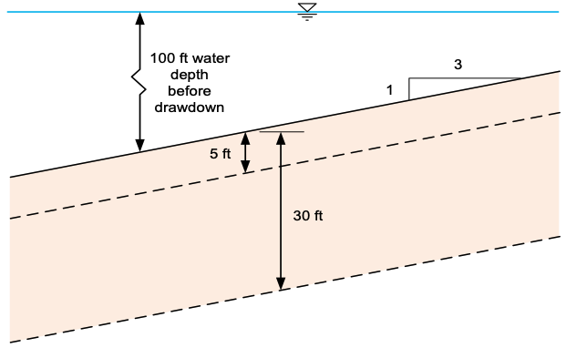

# Homework - Rapid Drawdown Analysis

In this assignment we will be performing a rapid drawdown analysis on an infinite slope using the equations and methodology outlined in the textbook:

[Chapter 9 - Analyses for Rapid Drawdown](https://ebookcentral.proquest.com/lib/byu/reader.action?docID=7104230&ppg=185){:target="_blank"}

We will be analyzing the following slope:

The slope has the following properties:

| Property   | Value | Units            |
|------------|-------|------------------|
| $\gamma_w$ | 62.4  | $\text{lb/ft}^3$ |
| $\gamma$   | 125   | $\text{lb/ft}^3$ |
| $\gamma'$  | 62.6  | $\text{lb/ft}^3$ |
| $c'$       | 0     | $\text{lb/ft}^2$ |
| $\phi'$    | 40    | degrees          |
| $d$        | 2000  | $\text{lb/ft}^2$ |
| $\psi'$    | 20    | degrees          |
| $h_w$      | 100   | $ft$             |
| $slope$    | 3:1   | -                |
| $\beta$    | 18.4  | degrees          |

Calculate the factor of safety for the slope under rapid drawdown conditions. Use the 
following Excel file to perform the calculations:

Excel starter file: [rapdraw.xlsx](rapdraw.xlsx)

Do your calculations in the following steps:

## Step 1: Pre-Drawdown

Calculate shear stresss and effective normal stress on failure surface based on pre-drawdown conditions

$\sigma'$ = effective normal stress under pre-drawdown conditions 
$\tau_1$ = shear stress under pre-drawdown conditions

$\sigma' = \gamma' z cos^2\beta \qquad \tau_1 = \gamma' z sin\beta cos\beta$

## Step 2: Post-Drawdown, Total Stress Analysis

Compute FS for post-drawdown conditions using total stress analysis

$t_{ff(K_c=1)}$ = Shear strength on the failure plane at failure with isotropic consolidation 
$t_{ff(K_c=K_f)}$ = Shear strength on the failure plane at failure with anisotropic consolidation corresponding to 
verge-of-failure conditions

$t_{ff(K_c=1)} = d + \sigma'_{fc} tan\psi \qquad t_{ff(K_c=K_f)} = c + \sigma'_{fc} tan\phi'$

$K_1$ = Actual anisotropy on on the failure plane 
$K_f$ = Anisotropy corresponding to verge-of-failure condition

$K_1 = \dfrac{\sigma'+\tau \left[\left(sin\phi'+1\right)/cos\phi'\right]}{\sigma'+\tau \left[\left(sin\phi'-1\right)
/cos\phi'\right]} \qquad K_f = \dfrac{\left(\sigma'+ c'cos\phi'\right)\left(1+sin\phi'\right)}
{\left(\sigma'- c'cos\phi'\right)\left(1-sin\phi'\right)}$

$t_{ff}$  = Shear strength found by interpolating the $K_c=1$ and $K_c=K_f$ strength envelopes using $K_1$ 
$t_2$ = shear stress on the failure plane using post-drawdown conditions.

$t_{ff} =\dfrac{\left(K_f-K_1\right)\tau_{ff(K_c=1)}+\left(K_1-1\right)\tau_{ff(K_c=K_f)}}{K_f-1} \qquad 
\tau_2=\gamma z sin\beta cos\beta$

Factor of safety for stage 2 is given by:

$FS = \dfrac{t_{ff}}{t_2}$

## Step 3: Post-Drawdown, Drained Strength Analysis

Compute FS for post-drawdown conditions using drained strengths

$\sigma'_{drn}$ = effective normal stress under drained (post-drawdown) conditions 
$\tau_{drn}$ =  shear strength under drained (post-drawdown) conditions

$\sigma'_{drn} = \gamma z cos^2\beta \qquad \tau_{drn} = c' + \sigma' tan\phi'$

Factor of safety for stage 3 is given by:

$FS = \dfrac{\tau_{drn}}{\tau_2}$

## Critical Factor of Safety

The ultimate factor of safety is the minimum of the two factors of safety calculated in steps 2 and 3.

## Submission

Submit your completed Excel file to the assignment on Learning Suite.
