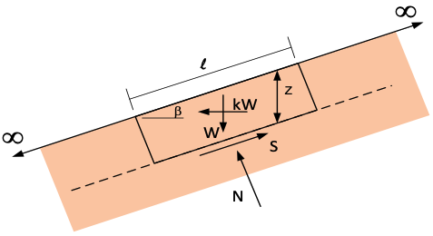
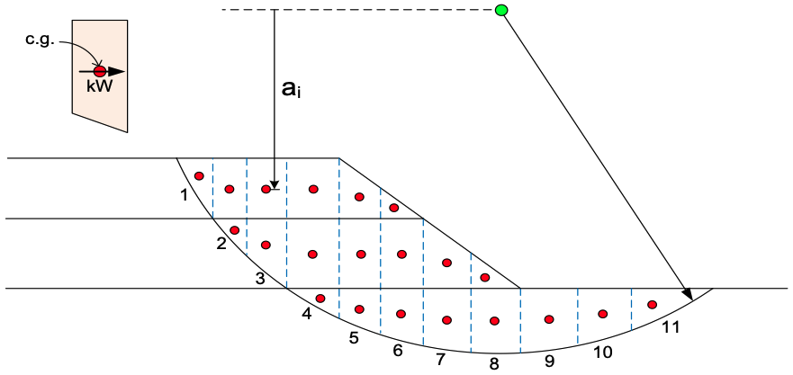

# Exercise - Seismic Slope Stability Analysis

In this exercise we will calculate the factor of safety for two slopes under seismic loading conditions. For the first slope, we will do an infinite slope analysis and for the second slope we will use the method of slices.

## Problem 1 - Infinite Slope Problem

A new subdivision is planned for bench to the east of Santaquin, Utah adjacent to Dry Mountain in Southern Utah 
County, Utah. There is a slope at the base of the mountain that shows evidence of slippage during past seismic 
events. Boring logs indicate that there is a layer of rock parallel to the slope at a depth of approximatley 25 ft. UU triaxial tests were conducted from samples taken from the site in a sandy clay layer near the bedrock. For 
infinite slopes, the factor of safety is given by:

>>$FS = \dfrac{S_u}{\gamma z cos\beta sin\beta + k\gamma z cos^2\beta}$

where:

>>$S_u$ = undrained shear strength of the soil (psf) 
$\gamma$ = unit weight of the soil (pcf) 
$z$ = depth to the failure plane (ft) 
$\beta$ = slope angle (degrees)

Assume the following values for the slope:

|         Parameter         | Value | Units |
|:-------------------------:|:-----:|-------|
|          $\beta$          |  21   | degrees |
|            $z$            |  25   | ft |
|         $\gamma$          |  120  | pcf |
|           $S_u$           | 2000  | psf |

Consider the following three cases:

| Case                       | Peak Acceleration (g)  | Acceleration Multiplier |
|:---------------------------|:----------------------:|:-----------------------:|
| 10% Exceedance in 50 years | [find using USGS tool] |           0.5           |
| 2% Exceedance in 50 years  | [find using USGS tool] |           0.5           |
| Threshold Case             |        [solve]         |           0.5           |

Do the following:

a. Enter an appropriate strength reduction factor and adjust the undrained strength.

b.  Enter a set of formulas to compute the factor of safety against slope failure under seismic conditions. For the first two cases, find the peak accelerations from the [USGS website](https://earthquake.usgs.
gov/hazards/interactive/){:target="blank"}.

c.  For the third case in the table, find the peak acceleration that results in a factor of safety = 1.0.

Use following Excel spreadsheet for your calculations:

Excel starter file: [seismic_infslope.xlsx](files/seismic_infslope.xlsx) 
Excel solution file: [seismic_infslope_KEY.xlsx](files/seismic_infslope_KEY.xlsx)

## Problem 2 - Method of Slices Problem

For this problem, we will revisit the method of slices problem that we solved earlier. The slope is shown in the figure below:

The original factor of safety for the OMS method is calculated as follows:

>>$FS = \dfrac{\sum {\left[c'\Delta l + \left(W cos\alpha - u \Delta l cos^2\alpha\right)\tan\phi'\right]}}{\sum {W\sin\alpha}}$

For a seismic analysis, we must compute the weight of each soil layer in each slice as follows:

Note that $a_i$ is the moment arm from the center of the circle to the centroid of the soil in each layer, $W_i$ is the weight of the soil in the layer, and $k$ is the seismic coefficient.

The factor of safety is calculated as follows:

>>$FS = \dfrac{R\sum {\left[c'\Delta l + \left(W cos\alpha - kWsin\alpha - u \Delta l\right)\tan\phi'\right]}}{R\sum 
{W\sin\alpha} + k\sum {Wa}}$

The following Excel spreadsheet is provided for your calculations. Fill in the missing formulas in the cells 
highlighted in yellow and compute the factor of safety for the slope under seismic conditions.

Excel starter file: [seismic_oms.xlsx](files/seismic_oms.xlsx) 
Excel solution file: [seismic_oms_KEY.xlsx](files/seismic_oms_KEY.xlsx)