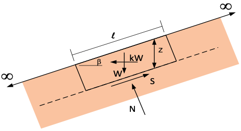
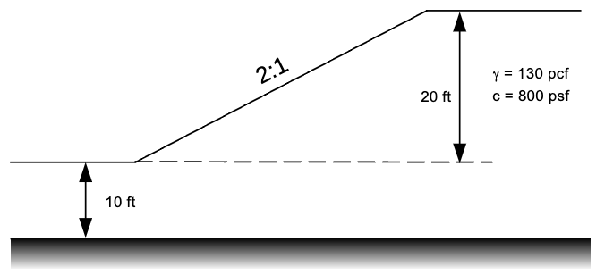
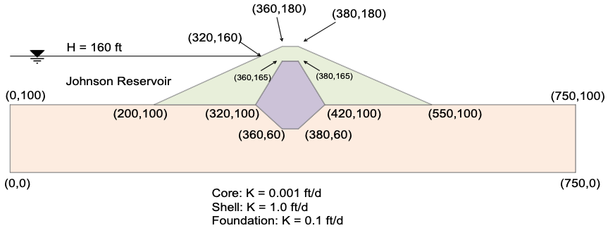

# Exercise - Seismic Slope Stability Analysis

In this exercise we will calculate the factor of safety for slopes under seismic loading conditions. For the first problem, we will do an infinite slope analysis by hand. For the second problem, we will use XSLOPE with the seismic coefficient to analyze slopes from earlier exercises.

## Problem 1 - Infinite Slope Problem

A new subdivision is planned for bench to the east of Santaquin, Utah adjacent to Dry Mountain in Southern Utah
County, Utah. There is a slope at the base of the mountain that shows evidence of slippage during past seismic
events. Boring logs indicate that there is a layer of rock parallel to the slope at a depth of approximatley 25 ft. UU triaxial tests were conducted from samples taken from the site in a sandy clay layer near the bedrock. For
infinite slopes, the factor of safety is given by:



>>$FS = \dfrac{S_u}{\gamma z cos\beta sin\beta + k\gamma z cos^2\beta}$

where:

>>$S_u$ = undrained shear strength of the soil (psf)<br>
$\gamma$ = unit weight of the soil (pcf)<br>
$z$ = depth to the failure plane (ft)<br>
$\beta$ = slope angle (degrees)

Assume the following values for the slope:

|         Parameter         | Value | Units |
|:-------------------------:|:-----:|-------|
|          $\beta$          |  21   | degrees |
|            $z$            |  25   | ft |
|         $\gamma$          |  120  | pcf |
|           $S_u$           | 2000  | psf |

Consider the following three cases:

| Case                       | Peak Acceleration (g)  | Acceleration Multiplier |
|:---------------------------|:----------------------:|:-----------------------:|
| 10% Exceedance in 50 years | [find using USGS tool] |           0.5           |
| 2% Exceedance in 50 years  | [find using USGS tool] |           0.5           |
| Threshold Case             |        [solve]         |           0.5           |

Do the following:

a. Enter an appropriate strength reduction factor and adjust the undrained strength.

b.  Enter a set of formulas to compute the factor of safety against slope failure under seismic conditions. For the first two cases, find the peak accelerations from the [USGS website](https://earthquake.usgs.gov/hazards/interactive/){:target="blank"}.

c.  For the third case in the table, find the peak acceleration that results in a factor of safety = 1.0.

Use following Excel spreadsheet for your calculations:

Excel starter file: [seismic_infslope.xlsx](files/seismic_infslope.xlsx)<br>
Excel solution file: [seismic_infslope_KEY.xlsx](files/seismic_infslope_KEY.xlsx)

## Problem 2 - Seismic Analysis with XSLOPE

In this problem, we will use XSLOPE to perform seismic slope stability analyses. The seismic coefficient ($k_h$) is entered on the **main** sheet of the Excel input template. This applies a horizontal pseudo-static force to each slice during the limit equilibrium analysis.

After preparing each set of inputs, launch the XSLOPE Google Colab notebook for stability analysis and upload your Excel input file and solve:

<a href="https://colab.research.google.com/github/njones61/xslope/blob/main/notebooks/xslope_lem.ipynb" target="_"></a>

### Part a - Simple Slope with Foundation and Seismic Load

For this problem, we will analyze a simple slope with a foundation layer under seismic loading conditions. The geometry of the problem is shown below:



Download the following Excel template which has the problem already set up:

[seismic_foundation.xlsx](files/seismic_foundation.xlsx)

Do the following:

1. Following the guidelines in the text, apply a strength reduction factor of 0.8 to the undrained shear strength. 
   Leave 
   the other 
   parameters 
   unchanged.
2. Upload the template to XSLOPE and solve for the static factor of safety (no seismic load, $k_h = 0$).
3. Edit $k_h = 0.1$ on the **main** sheet and re-solve. Compare the factor of safety to the static case.
4. Increase the seismic coefficient to $k_h = 0.2$ and solve again. Note the change in factor of safety and the location of the critical circle.

**Note**: You could modify the seismic coefficient in the Excel file and re-upload to the Colab notebook each time, but this can be time consuming. Instead, you can modify the k_h value directly in the notebook code. Add a new cell just before the cell that computes the solution and add the following code:

```python
# Change the seismic k value
slope_data['k_seismic'] = 0.1
```

Run the cell after modifying it, and then run the rest of the notebook to solve with the new seismic coefficient.

Solution: [seismic_foundation_KEY.xlsx](files/seismic_foundation_KEY.xlsx)

### Part b - Johnson Reservoir with Seismic Load

In this problem, we will analyze the Johnson Reservoir dam under seismic loading conditions. Since this is a 
constructed embankment, we will use the R-envelopes for the core and foundation layers. This approach uses pre-earthquake loading conditions (pore pressures and effective stresses) to scale an undrained strength to use in the analysis. The geometry of the problem is shown below:



Download the following Excel template which has the dam geometry, seepage boundary conditions, and distributed loads already set up:

[seismic_johnson_res.xlsx](files/seismic_johnson_res.xlsx)

The original material properties are as follows:

| Material   | $\gamma$ (pcf) | Option | c (psf) | $\phi$ (deg) |
|:----------:|:-------:|:------:|:-------:|:-------:|
| Shell      | 130     | mc     | 100     | 35      |
| Core       | 125     | mc     | 400     | 18      |
| Foundation | 127     | mc     | 100     | 27      |

The pore pressure option ($u$) for each material is set to `seep`. First, run the seepage analysis by uploading the Excel file to the XSLOPE seepage notebook and downloading the resulting zip archive:

<a href="https://colab.research.google.com/github/njones61/xslope/blob/main/notebooks/xslope_seep.ipynb" target="_"></a>

Then upload the zip archive to the LEM notebook:

<a href="https://colab.research.google.com/github/njones61/xslope/blob/main/notebooks/xslope_lem.ipynb" target="_"></a>

and do the following:

#### Static Analysis

1. Solve for the static factor of safety ($k_h = 0$).
2. Note the factor of safety and the location of the critical circle.

#### Seismic Analysis

1. Open the Excel template and change the material properties to:

| Material   | $\gamma$ (pcf) | Option | $c_R$ (psf) | $\phi_R$ (deg) |
|:----------:|:-------:|:------:|:-----------:|:--------------:|
| Shell      | 130     | mc     |    1400     |      22.5      |
| Core       | 125     | mc     |     700     |       12       |
| Foundation | 127     | mc     |     400     |       18        |

2. Add a seismic coefficient of $k_h = 0.15$ on the first page of the Excel file.
3. Save and rezip the archive and upload to the LEM notebook. 
4. Solve and compare to the static factor of safety.
5. Try to find the value of $k_h$ that results in a factor of safety of approximately 1.0. You can do this by adjusting $k_h$ on the main sheet and re-running the analysis.

See note above in part a for how to modify the seismic coefficient directly in the notebook code to save time.

Solution: [seismic_johnson_res_KEY.zip](files/seismic_johnson_res_KEY.zip)
