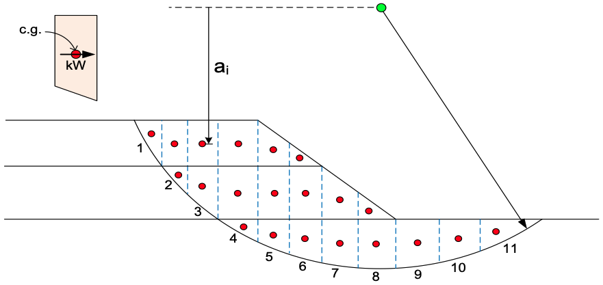

# Homework - Bishop's Simplified Procedure with Seismic Loads

In this exercise we will revisit the Bishop's Simplified Procedure method of slices solution, but this time we will consider seismic loads. The slope details are as follows:

The original equation for the BSP method is:

$$
F = \frac{\sum {\left[\frac{c'\Delta l + \left(W cos\alpha - u \Delta l cos^2\alpha\right)\tan\phi'}{cos\alpha + \left(sin\alpha\tan\phi'\right)/F}\right]}}{\sum {W\sin\alpha}}
$$

For seismic loads, we need to add the seismic forces to the equation. The seismic forces are calculated using the seismic coefficient, $k$, and the weight of the slice, $W$. The seismic forces are calculated as follows:

The seismic forces are then added to the factor of safety equation as follows:

$$
F = \frac{\sum{\left[\left(c'\Delta l cos\alpha + \left(W - u \Delta l cos\alpha\right)\tan\phi'\right)\left(\dfrac{sec\alpha}{1+tan\alpha\frac{tan\phi'}{F}}\right)\right]}}{\sum{W\sin\alpha+\dfrac{k}{R}\sum{Wa}}}
$$

The seismic parameters are as follows:

| Parameter                      | Value |
|--------------------------------|-------|
| Peak Ground Acceleration (PGA) | 0.18g |
| Acceleration Multiplier        | 0.5   |
| Strength Reduction Factor (R)  | 0.8   |

Use the PGA and the acceleration multiplier to calculate the seismic coefficient, $k$.

The soil properties are as follows:

| Layer | $\gamma \quad [lb/ft^3]$ | $c_r \quad [lb/ft^2]$ | $\phi_r \quad [deg]$ |
|:-----:|:------------------------:|:----------------:|:---------------:|
|   1   |           130            |       800        |       30        |
|   2   |           120            |       600        |       25        |
|   3   |           110            |       400        |       20        |

Adjust the strength parameters for the seismic loads using the strength reduction factor, $R$. Remember to apply the reduction factor to $tan\phi_r$, not $\phi_r$.

Use the following Excel file to calculate the factor of safety for the slope. Note that the factor of safety is on both sides of the equation. Therefore, you must guess at the F, solve for F, and iterate until the calculated F is equal to the guessed F. The Excel file has a formula for the residual ($F_{guess} - F_{calculated}$) to help you determine when the calculated F is equal to the guessed F. You can also use the **Goal Seek** function in Excel to solve for F.

Excel starter file: [seismic_bsp.xlsx](seismic_bsp.xlsx)

## Submission

Upload your completed Excel file to Learning Suite.