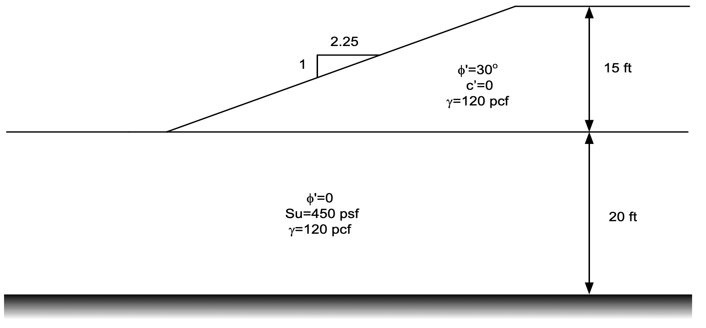
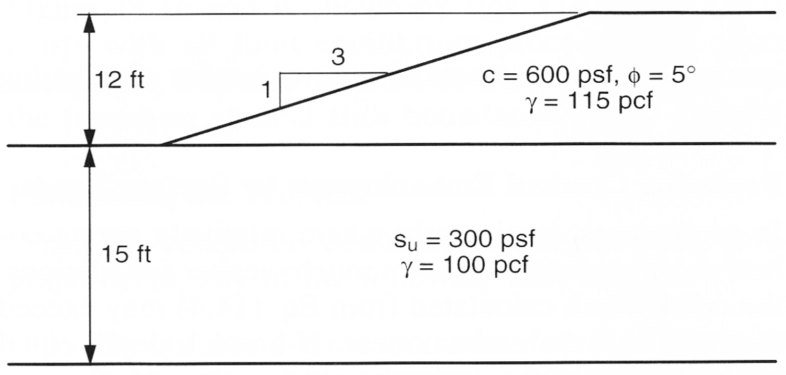

# Exercise - Important Details of Stability Analysis

In this exercise, we will examine two important details of stability analysis. In the first problem, we will review a problem that involves multiple slip circles that each result in a different critical factor of safety when doing an automatic search using UTEXASED. In the second problem, we will explore using a tension crack to avoid an unconservative solution involving tension at the top of a slope. 

## Problem 1 - Multiple Local Minima

Consider the following slope with two layers of soil.

{width=800px}

Using the Excel file below and UTEXASED, do the following:

1) Determine the correct profile line coordinates

2) Enter profile lines and material properties input to UTEXASED

3) Select appropriate starting circle locations for two cases:

>>a) Circle tangent to bottom of upper layer

>>b) Circle tangent to bottom of lower layer

>>Which case is critical? Why

4) Compute the infinite slope solution for the slope. Compare to previous answers.

Excel starter file: [mutiple_min_inputs.xlsx](mutiple_min_inputs.xlsx)

Excel solution file: [mutiple_min_inputs_KEY.xlsx](mutiple_min_inputs_KEY.xlsx)

UTEXASED solution file: [multiple min.input-utexased](multiple%20min.input-utexased)

## Problem 2 - Tension Cracks

Consider the following slope:

{width=800px}

Because the top layer has a cohesion > 0, if you solve this problem with UTEXASED, you will get a warning about tension at the top of the slope. This is unconservative because the tension will increase the factor of safety. To avoid this, we can add a tension crack at the top of the slope. The depth of the crack is computed as follows:

>>$d_{crack} = \dfrac{2c_d}{\gamma tan\left(45 - \dfrac{tan\phi_d}{2}\right)}$

>>$c_d = \dfrac{c}{F} \quad tan\phi_d = \dfrac{tan\phi}{F}$

Note that the depth of the crack is a function of the factor of safety, F. This required you to guess a value of F, compute the depth of the crack, and then recompute the factor of safety. You will need to iterate until the factor of safety converges.

Use the following Excel file and UTEXASED to solve this problem:

Excel starter file: [tension_crack_inputs.xlsx](tension_crack_inputs.xlsx)

Excel solution file: [tension_crack_inputs_KEY.xlsx](tension_crack_inputs_KEY.xlsx)

UTEXASED solution file: [tension crack.input-utexased](tension%20crack.input-utexased)
