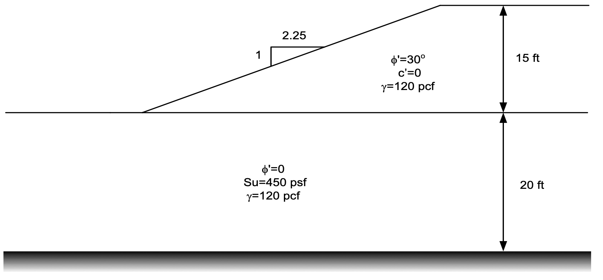
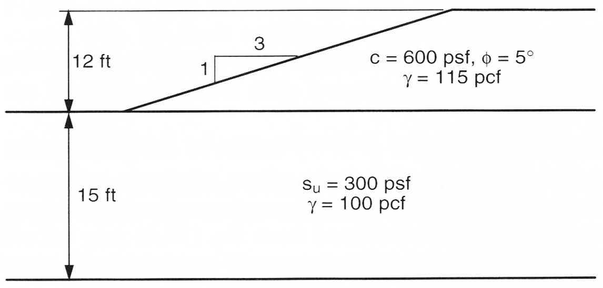

# Exercise - Important Details of Stability Analysis

In this exercise, we will examine two important details of stability analysis. In the first problem, we will review a problem that involves multiple slip circles that each result in a different critical factor of safety when doing an automatic search using XSLOPE. In the second problem, we will explore using a tension crack to avoid an unconservative solution involving tension at the top of a slope.

Start with the standard Excel input template:

[input_template.xlsx](https://xslope.org/en/latest/inputs/input_template.xlsx)

After preparing each set of inputs, launch the XSLOPE Google Colab notebook for stability analysis and upload your Excel input file and solve:

<a href="https://colab.research.google.com/github/njones61/xslope/blob/main/notebooks/xslope_lem.ipynb" target="_"></a>

## Problem 1 - Multiple Local Minima

Consider the following slope with two layers of soil.

{width=800px}

Using the input template and XSLOPE, do the following:

1) Set up the material properties table.

2) Build the profile lines for the slope. Make the toe of the slope at (x=0, y=0). Extend the profile line for the foundation 50 feet to the left of the toe. Extend right end of both lines 50 feet to the right of the top of the slope.

3) Enter a single starting circle at the following location:

>>$X_0$ = 11.25 ft<br>
>>$Y_0$ = 40 ft<br>
>>Depth = 0 ft (at base of the embankment)

4) Save and ompute the factor of safety for this starting circle. What do you notice about the location of the critical slip circle?

5) Calculate the factor of safety for the embankment using the infinite slope solution. How does this compare to the factor of safety from XSLOPE?

>>$F = \dfrac{\tan\phi}{\tan\beta}$

How does this compare to the factor of safety from XSLOPE?

6) Now, solve again using a single starting circle at this location:

>>$X_0$ = 11.25 ft<br>
>>$Y_0$ = 40 ft<br>
>>Depth = -20 ft (at base of the foundation)

What do you notice about the location of the critical slip circle? How does the factor of safety compare to the previous case?

7) Now, change the input template to include both starting circles. What do you notice about the location of the critical slip circle? How does the factor of safety compare to the previous cases?

Solution: [xslope_mult_min_KEY.xlsx](files/xslope_mult_min_KEY.xlsx)

## Problem 2 - Tension Cracks

Consider the following slope:

{width=800px}

Because the top layer has a cohesion > 0, if you solve this problem with XSLOPE, you will get a solution with tension at the top of the slope and an inverted line of thrust. This is unconservative because the tension will increase the factor of safety. To avoid this, we can add a tension crack at the top of the slope. The depth of the crack is computed as follows:

>>$d_{crack} = \dfrac{2c_d}{\gamma tan\left(45 - \dfrac{tan\phi_d}{2}\right)}$

>>$c_d = \dfrac{c}{F} \quad tan\phi_d = \dfrac{tan\phi}{F}$

Note that the depth of the crack is a function of the factor of safety, F. This required you to guess a value of F, compute the depth of the crack, and then recompute the factor of safety. You will need to iterate until the factor of safety converges.

The tension crack depth is entered on the **main** sheet of the XSLOPE input template.

Do the following:

1) Use the input template to set up the material properties table and profile lines for the slope. 

2) Make the toe of the slope at (x=0, y=0). Extend the profile line for the foundation 30 feet to the left of the toe. Extend right end of both lines to x = 80 feet.

3) Enter two starting circles, one at the base of the embankment and one at the base of the foundation.

4) Save and compute the factor of safety for this slope. Note the tension at the top of the slope and the inverted line of thrust. 

5) Download this Excel file and calculate the theoretical depth of the tension crack using the equations above.

Excel starter file: [tension_crack_calculations.xlsx](files/tension_crack_calculations.xlsx)<br>

6) Enter the depth you calculated in the input template and solve again. How does the factor of safety compare to the previous case? What do you notice about the tension at the top of the slope and the line of thrust?

7) Now, iteration on the depth of the tension crack until you find a depth where the tension crack just disappears. 

Note: As you iterate, rather than changing the depth in the Excel file and re-uploading to the Colab notebook, you can modify the depth value directly in the notebook code. Add a new cell just before the cell that computes the solution and add the following code:

```python
# Change the depth of the tension crack
slope_data['tcrack_depth'] = 8.5
```

8) After iterating, edit the input file to include water in the crack to the full depth of the crack. What is the factor of safety for this case? How does it compare to the previous cases?

Solution: [tension_crack_calculations_KEY.xlsx](files/tension_crack_calculations_KEY.xlsx)<br>
Solution: [xslope_tension_KEY.xlsx](files/xslope_tension_KEY.xlsx)
