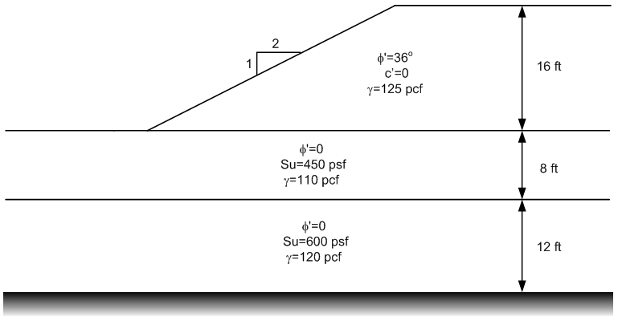

# Homework - Important Details of Stability Analysis

Complete the following two problems:

1) Consider the following slope:

Create the inputs for the problem using UTEXASED. Find global-minimum factor safety by trying several different starting locations for the automated search. Save your solution.

2) Consider the following slope:

Create the inputs for the problem using UTEXASED. Then compute a solution for the following three conditions (save each version to a different file name):

a) As-is with no tension crack. Save a copy of your solution.

b) Note that you have tension in the active zone. Use a spreadsheet to estimate the appropriate depth for a tension crack using the equations we discussed in class using an estimated factor of safety. Enter this tension crack depth and recompute the factor of safety. Adjust the depth of the crack up and down until you find a depth that is just on the threshold of eliminating tension. Save a copy of your solution.

c) Fill your tension crack with water iterate again. Save a copy of your solution.

## Submission

Zip up all four solutions (the INPUT file for UTEXASED) and the spreadsheet into a single zip archive. Upload your zip archive via Learning Suite.

## Grading Rubric

**Total: 30 points**

| Criteria | Points |
|----------|:------:|
| Problem 1: UTEXASED model setup | 5 |
| Problem 1: Multiple search locations attempted | 3 |
| Problem 1: Global minimum FS found | 4 |
| Problem 2a: As-is solution | 5 |
| Problem 2b: Tension crack depth determination | 6 |
| Problem 2b: Iterative adjustment and new FS | 3 |
| Problem 2c: Water-filled crack solution | 3 |
| Documentation quality | 1 |